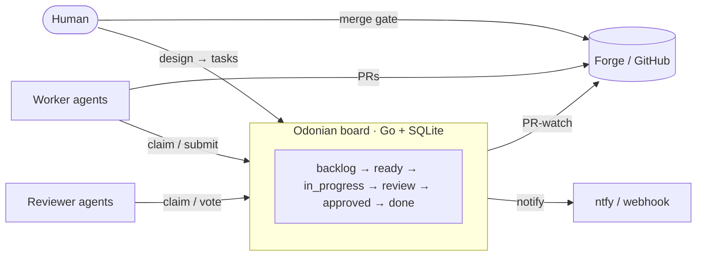

<p align="center">
  <picture>
    <source media="(prefers-color-scheme: dark)" srcset="docs/assets/logo-dark.svg">
    
  </picture>
</p>

# Odonian

[](https://github.com/boldfield/odonian/actions/workflows/ci.yml)
[](./LICENSE)

**A task board that AI agents volunteer for — and a human gate they can't get past.**

Odonian is the coordination substrate under a fleet of AI coding agents. You decompose a design
into bite-size tasks on a per-project board; workers claim tasks **pull-model** (nothing is ever
assigned), execute them, and submit for review; reviewer agents vote; and every merge waits for a
human. It is the control plane only — a work queue with a precise state machine, atomic claiming,
lease-based crash recovery, and review routing, behind a small REST API. It is **not a kanban
UI** — there is no drag-drop or visualization; the board is a queue with claiming primitives.

Two convictions shape the design:

- **Work is claimed, not assigned.** Agents volunteer for tasks they can do; the substrate only
  guarantees that claiming is atomic and that dependencies are honored. There is no scheduler
  handing out orders.
- **The machines labor; a human makes the living judgment.** Agents write and review every line,
  but nothing merges without a person deciding it should. The review gate is architecture, not
  policy.



> **Why "Odonian"?** From Ursula K. Le Guin's *The Dispossessed*: the Odonians of Anarres
> organize work through voluntary association — postings that workers claim because the work is
> worth doing, with no boss dispatching them. That is this system's pull model, and the name is
> the license's politics too.

## Quickstart

```bash
make build
export ODONIAN_TOKEN="your-secret-token"
export ODONIAN_DB="./odonian.db"
./bin/odonian server           # REST API on :8080; DB created on first run

make tui && ./bin/odonian-tui  # optional terminal UI for human oversight
```

Then create a project, register a design doc, and post tasks via the [API](./docs/api.md) — or
let the [`odonian-breakdown` skill](#skills) do it conversationally. Point the
[worker/reviewer harness](#the-worker--reviewer-harness) at the board and the fleet starts
draining it. Full server, fleet, and sandbox instructions are in
[How to Run It](#how-to-run-it).

## What It Is

Odonian exists to power this workflow:

1. Design a feature and formalize it in a design document.
2. Decompose the design into **bite-size tasks** — each well-scoped enough that a senior engineer would hand it to someone for execution.
3. Register the document and create tasks on a per-project board.
4. A pool of **execution agents** (e.g., Haiku) claim tasks, execute them, and submit for review.
5. **Reviewer agents** (e.g., Opus) review the work; a **human** merges and gates the final ship.

## The Core Model

**Projects → Documents → Tasks**

- **Project**: Maps to one code repository (e.g., `https://github.com/myorg/myrepo`). Created and known upfront.
- **Document**: Either a `design` (one per project) or a `feature_spec`. Lives in the project's repo (e.g., `DESIGN.md`, `docs/features/foo.md`). Odonian stores only the ref and optional commit pin; content is not centralized.
- **Task**: A unit of work decomposed from a document. Has a spec, assigned model (e.g., `haiku`, `opus`), and required reviewers.

**State Machine**

```
backlog ──promote──► ready ──claim──► in_progress ──submit──► review ──approve──► approved ──merge──► done
                       ▲                    │                     │                     │
                       └──── lease expiry ──┘             reject──┘ (→ ready)    ──────┘
                                                                            PR-watch:
                                                                      merged → done
                                                                      closed → abandoned

                      blocked / failed / superseded / abandoned are off-ramps
```

- **backlog**: Initial state. Task is not yet claimable.
- **ready**: Human has promoted it. Task is claimable (subject to dependencies).
- **in_progress**: Agent has claimed it and is executing. Lease governs crash recovery.
- **review**: Agent submitted work. Reviewers vote. On rejection, task returns to `ready`.
- **approved**: All reviewers voted approve. Awaits human merge (or PR-watch driven transitions).
- **done**: Work is merged.
- **blocked / failed / abandoned**: Off-ramps. Abandoned is terminal (PR closed without merging or task explicitly abandoned).
- **superseded**: Terminal. The task was replaced by a recreated one — dependents are re-pointed at the replacement and the stale attempt's PR is closed. This is the recovery path for tasks whose spec or approach was wrong (`failed` has no revive).

**Dependencies & Claiming**

A task is **claimable** iff:
- It is in `ready` state (human promoted it).
- All its dependencies are `done`.
- It has no active lease (crashed agent recovery).
- It is not `held` (a human hold flag that pauses claiming without changing state).

Claiming is a single atomic database transaction — no locks, no broker, no race conditions.
Leases are checked lazily: if an agent dies, its lease expires, and the task becomes claimable
again. No background sweeper has been needed, including under a production fleet of ~10
concurrent agents.

**Task Kind & Review**

Each task has a `kind`:
- **implement**: Execution work. Claims a model (e.g., `haiku`), carries a spec, and specifies which models review it (e.g., `["opus", "sonnet"]`). On submit, review tasks are auto-spawned.
- **review**: Review work. Auto-created per reviewer model. Points back to its parent implement task. Reviewers vote; results are aggregated (majority or unanimous, configurable per deployment).

## The API

All endpoints (except `/healthz`) require `Authorization: Bearer <token>` header.

**Server Configuration:**
- `ODONIAN_TOKEN` (required): The bearer token for authentication.
- `ODONIAN_DB` (required): SQLite database path (e.g., `/data/odonian.db`).
- `ODONIAN_ADDR` (optional, default `:8080`): Server address.
- `ODONIAN_MODELS` (optional, default `haiku,sonnet,opus`): Comma-separated list of valid model names. This is the allowlist for all models that can claim tasks or be specified as reviewers.
- `ODONIAN_ESCALATION_LADDER` (optional): Comma-separated list of models in escalation order for reviewer routing. Defaults to `ODONIAN_MODELS` if unset. Every model in this ladder must be in `ODONIAN_MODELS`. Models can be valid review models without being in the escalation ladder — for example, `gpt-5.5` can be specified as a reviewer model via the Codex CLI (see below) without being in the escalation ladder.
- `ODONIAN_ESCALATION_THRESHOLDS` (optional): Per-tier reject-round thresholds before a task escalates to the next ladder model, as comma-separated `model=N` pairs (e.g., `haiku=3,sonnet=2,opus=2`). Exceeding the top tier blocks the task.
- `ODONIAN_LEASE_TTL` (optional): Claim lease duration (e.g., `30m`). Kept generous in practice — renewal is agent-driven, and a session that outlives its lease loses the task to reclamation.
- `FORGE_TOKENS` (optional): Path to the forge tokens file for GitHub API authentication (defaults to `~/.odonian/forge-tokens`). Only needed if PR-watch reconciler is enabled.

See [`docs/api.md`](./docs/api.md) for the full API reference with all request/response examples.

**Key Endpoints**

- `GET /healthz` — Health check (no auth).
- `POST /projects`, `GET /projects`, `GET /projects/{id}` — Manage projects.
- `POST /projects/{id}/documents`, `GET /projects/{id}/documents` — Register and list design/spec documents.
- `POST /projects/{id}/tasks`, `GET /projects/{id}/tasks` — Bulk-create and list tasks (with filters: `state`, `model`, `kind`, `claimable`).
- `GET /tasks/{id}` — Get task with dependencies and links.
- `POST /tasks/{id}/claim` — Atomic claim (agent → `in_progress` with lease).
- `POST /tasks/{id}/heartbeat` — Extend lease (agent signals it is alive).
- `POST /tasks/{id}/submit` — Agent submits work (→ `review`, auto-spawns review tasks).
- `POST /tasks/{id}/review` — Reviewer votes (verdict, notes).
- `POST /tasks/{id}/promote`, `POST /tasks/{id}/transition` — Human promotion and state transitions.
- `POST /tasks/{id}/archive`, `POST /tasks/{id}/unarchive` — Soft-archive tasks and projects.

**Links**

Tasks can carry typed links:
- `pr`: Pull request (e.g., GitHub PR URL).
- `branch`: Git branch (e.g., `mr/abc123def456`).
- `commit`: Commit SHA.
- `ci`: CI run (e.g., test result).

Links are indexed and can be queried in reverse (e.g., find the task for a given PR URL).

## Notifications

Odonian includes an in-process notification loop that notifies external systems when a task
requires human attention. The notifier is **level-triggered** and runs at regular intervals,
checking for tasks in terminal states and POSTing to a configurable webhook.

**When notifications are sent:**

The notifier monitors tasks in three states and sends notifications to the `NOTIFY_URL` endpoint
(if configured). The state-to-event mapping and recency rules are:

| Task State | Event              | Priority | Notes                                                     |
|------------|--------------------|----|----------------------------------------------|
| `approved` | `odonian-review`  | P2 | Task has passed review and awaits human merge decision    |
| `blocked`  | `odonian-blocked` | P2 | Task was blocked and requires human intervention          |
| `failed`   | `odonian-failed`  | P3 | Task failed; only notified within `NOTIFY_FAILED_WINDOW` (default 1h, recency-windowed) |

The notifier is a **no-op** when `NOTIFY_URL` is unset — notifications are simply not sent, and
no errors are logged.

**Configuration:**

Set the following environment variables to enable notifications:

- `NOTIFY_URL` (required): The webhook URL to POST notifications to. If unset, notifications are
  disabled entirely. Example: `https://your-notifier.example.com/notify`.
- `NOTIFY_TOKEN` (required if `NOTIFY_URL` is set): Bearer token used to authenticate requests
  to the webhook. Sent as the `Authorization: Bearer <token>` header.
- `NOTIFY_INTERVAL` (optional, default `30s`): How often the notifier checks for tasks in need
  of notification. Duration format: `30s`, `1m`, etc.
- `NOTIFY_FAILED_WINDOW` (optional, default `1h`): Time window within which a failed task triggers
  notifications. Tasks that failed more than this duration ago are not notified. Duration format:
  `1h`, `30m`, etc.

**Example:**

```bash
export NOTIFY_URL="https://notifier.example.com/notify"
export NOTIFY_TOKEN="your-secret-token"
export NOTIFY_INTERVAL="30s"
export NOTIFY_FAILED_WINDOW="1h"
./bin/odonian server
```

## PR-Watch Reconciler

The PR-watch reconciler runs in-server on the reconcile runner and watches GitHub pull requests
linked to approved tasks. It drives state transitions on the board based on PR activity, enabling
human-gated workflows where code review and approval happen on GitHub, and Odonian remains
synchronized with the PR's state.

**How It Works**

The reconciler monitors all `approved` tasks that have `agent_merge=false` (i.e., tasks awaiting
human action). For each task with a linked GitHub PR URL, it fetches the PR's current state and
review decisions from GitHub, then applies one of four actions:

| PR State              | Action                                                      |
|----------------------|-------------------------------------------------------------|
| `merged`             | Task transitions to `done` and fires `odonian-merged` event |
| `closed` (unmerged)  | Task transitions to `abandoned`                             |
| `open` + `changes requested` (newer than approval) | Task bounces back to `ready` for rework |
| All other states     | No action (continues monitoring)                             |

**State Transitions**

- **PR merged → done**: When the PR is merged, the task is marked complete. An `odonian-merged`
  notification is published to alert external systems of the merge.
- **PR closed unmerged → abandoned**: If the PR is closed without merging, the task is marked
  `abandoned` — a terminal state indicating it will not be completed.
- **PR 'changes requested' → ready**: If a reviewer posts 'changes requested' on the PR *after*
  the task was approved, the reconciler bounces it back to `ready` and posts a comment on the
  PR explaining that the task has been returned for rework.
- **Abandoned is terminal**: Once a task is in the `abandoned` state, it cannot transition to
  any other state (it is a permanent off-ramp for work that is no longer needed).

**GitHub Authentication**

The reconciler requires GitHub API tokens to fetch PR state and post comments. Tokens are read
from a file specified by the `FORGE_TOKENS` environment variable (or `~/.odonian/forge-tokens`
if unset). The file format is one owner-token pair per line:

```
# File: ~/.odonian/forge-tokens (or $FORGE_TOKENS)
owner1=token_for_owner1
owner2="token_for_owner2"  # quoted tokens are supported
# Comments are allowed
owner3=token_for_owner3
```

Tokens are **server-side per-owner**: each GitHub organization owner has its own API token,
allowing the server to act on behalf of that owner when accessing private repos. The reconciler
looks up the owner from the PR URL and fetches the corresponding token to authenticate requests.

**Configuration**

Set the `FORGE_TOKENS` environment variable to point to your tokens file:

```bash
export FORGE_TOKENS="/path/to/forge-tokens"
./bin/odonian server
```

If unset, the reconciler defaults to `~/.odonian/forge-tokens`. If no tokens file exists, the
reconciler proceeds with unauthenticated GitHub API calls: for public repos this may succeed
(subject to GitHub's 60 req/hr unauthenticated rate limit), but for private repos the requests
fail with 401/404 errors that are logged each reconcile cycle. If you do not need GitHub
integration (development or local deployments), create an empty tokens file or set
`FORGE_TOKENS` to point to an empty file.

## How to Run It

### Build

```bash
# Server
make build
./bin/odonian server

# TUI (optional)
make tui
./bin/odonian-tui
```

### Server

Set environment variables:

```bash
export ODONIAN_TOKEN="your-secret-token"
export ODONIAN_DB="/path/to/odonian.db"
export ODONIAN_ADDR=":8080"  # optional, default :8080
```

Then run:

```bash
./bin/odonian server
```

The server will listen on the configured address and expose the REST API. The database is created
automatically on first run.

### TUI

The optional terminal UI (`cmd/odonian-tui`) displays projects, documents, and tasks organized by state, with filtering and search. It supports confirm-gated actions to archive and unarchive tasks and projects. Run it against the server:

```bash
./bin/odonian-tui
```

Useful for human oversight and management of the board.

### Testing & Checks

```bash
make test      # Run tests
make check     # Run gofmt, go vet, and go mod tidy checks
```

### Deployment

The odonian server ships as a single container image; this repository's responsibility is **building and pushing that image** (`make release`). Kubernetes deployment of the server is owned by your own infrastructure repo — a kustomization with a namespace, PVC, deployment, and service is all it takes (the deployment needs `replicas: 1` and `strategy: Recreate`: SQLite is single-writer).

Note: `deploy/fleet/` remains in this repository because it contains build inputs (Dockerfile.fleet, Dockerfile.merger, fleet-entrypoint.sh) that must live alongside fleet deployment manifests — they are tightly coupled to the build pipeline and the fleet's lifecycle.

## The Worker & Reviewer Harness

See [`harness/README.md`](./harness/README.md) for a deep dive.

**High-Level Overview**

The `harness/` directory contains a fleet of headless agents:

- **Workers**: Claim `implement` tasks across all models, execute them via `claude -p`, and submit results.
  - `worker.sh`: Generic implementer for any model tier.
- **Reviewers**: Claim `review` tasks across all models, run `claude -p` to produce verdicts, and submit votes.
  - `reviewer.sh`: Generic reviewer for any model tier.

Each agent:
1. Polls for claimable work of its `kind` across all models.
2. Claims a task atomically (the task specifies the model).
3. Dispatches one `claude -p` task with the appropriate model (with a prompt that includes the spec).
4. Waits for completion.
5. Submits the result and repeats.

Agents stand up their own git worktrees (one per repo), so multiple agents can work in parallel
without stepping on each other.

**Rework & the feedback gate.** When a human bounces a PR (changes requested), the task returns
to `ready` and the next worker session is a **rework**: it must enumerate every unaddressed PR
feedback item — inline review threads and global comments — with `odonian pr-feedback list`,
fix each, and acknowledge each with `odonian pr-feedback ack` (a marker-stamped reply, plus
thread resolution or a 👍 reaction). The gate is mechanical, not just prompted: `odonian submit`
refuses to submit while unaddressed items remain. Because the fleet shares one GitHub identity
with its human, agents self-identify in PR comments with `<model>-<role>:` markers
(`haiku-worker:`, `opus-reviewer:`) — that convention is how the tooling tells agent comments
from human ones. See
[`docs/specs/2026-08-18-pr-feedback-single-identity.md`](./docs/specs/2026-08-18-pr-feedback-single-identity.md).

**Review-Only Models via Codex**

Some models (e.g., `gpt-5.5`) are available as review-only models via the Codex CLI. These models do not need to be in `ODONIAN_ESCALATION_LADDER` and are routed through the Codex sandbox rather than the direct Claude API.

To enable Codex routing:

- `AGENT_CODEX_MODELS` (optional): Comma-separated list of models to route through `codex exec` (e.g., `gpt-5.5`). When a reviewer's model is in this list, the harness invokes `codex exec --sandbox danger-full-access` instead of the standard `claude -p` command.
- `AGENT_CODEX_FLAGS` (optional): Additional flags to pass to `codex exec` beyond the hardcoded `-c model_reasoning_effort=high` (e.g., `-c temperature=0.7`, `--timeout 120`).

The fleet image bundles the Codex CLI (installed via `npm install -g @openai/codex`); no manual installation is required.

Reviewers using Codex-routed models require the `codex-auth` subscription secret to be configured in their environment so they can authenticate with the Codex CLI.

**Running the Harness**

```bash
cd harness
export ODONIAN_PROJECT="<project-id>"
export ODONIAN_REPO="~/projects/<repo>"

# Start workers in separate terminals:
./worker.sh worker-1
./worker.sh worker-2

# Start reviewers in separate terminals:
./reviewer.sh reviewer-1
./reviewer.sh reviewer-2
```

For multi-project mode and advanced configuration, see [`harness/README.md`](./harness/README.md).

### Running inside an `sbx` sandbox (`sbx.sh`)

To boot the **entire stack — server + fleet — self-contained inside an `sbx` sandbox**, use
[`harness/sbx.sh`](./harness/sbx.sh). One command starts the odonian server (local SQLite DB + a
fixed local token), polls `/healthz` until it's up, and launches N workers + N reviewers — keeping
**all state under `/tmp/odonian`** (nothing touches `~/.odonian`, your repos, or GitHub).

```bash
# Drain a project backed by a LOCAL git repo (local_commit mode — the CLI commits; no PR/forge):
bash harness/sbx.sh --project <uuid> --repo <path-to-local-git-repo>

# …or a fully self-contained throwaway demo (creates its own repo + project + board):
bash harness/sbx.sh --seed-demo

# Manage it without Ctrl-C (handy when launched from inside an agent):
bash harness/sbx.sh status
bash harness/sbx.sh stop
```

Workers and reviewers are **model-dynamic** (each runs `claude` with the task's own model). Inside a
sandbox, a nested `claude -p` needs `--allow-dangerously-skip-permissions` alongside
`--dangerously-skip-permissions`; `sbx.sh` supplies it via the `AGENT_CLAUDE_FLAGS` env var that
`agent.sh` appends (empty and harmless outside the sandbox). See
[`harness/README.md`](./harness/README.md#running-inside-an-sbx-sandbox-sbxsh) for the full flag,
delivery-mode, and shutdown reference.

## Skills

Odonian ships two [Claude Code](https://docs.claude.com/claude-code) **skills** (`SKILL.md` agents)
covering the two human-facing ends of the workflow — turning intent into a board, and draining the
review gate. They live alongside the model-pinned fleet: `odonian-breakdown` fills the board, the
workers and reviewers drain it, and `review` is how the human inspects and gates the `approved` lane.
Each triggers on natural-language requests inside an interactive `claude` session.

### `odonian-breakdown` — intent → board

[`skills/odonian-breakdown/`](./skills/odonian-breakdown/SKILL.md) drives the collaborative front
of the pipeline: **brainstorm the design → formalize a `design`/`feature_spec` doc → (greenfield)
create the repo → decompose into bite-size, model-pinned tasks → register the project, document, and
tasks via the API.** It proposes and takes positions but **stops for the human's decision** at every
design choice, task boundary, and spec — it never finalizes alone. Its decomposition rules encode the
system's conventions: no code in a spec, every coding task is Haiku-sized (decompose finer rather than
escalate to a bigger model), and same-file tasks are dependency-ordered to avoid the merge-conflict
trap. Ships helper scripts (`scripts/odonian.sh`, `scripts/create-repo.sh`). Triggers on requests
like *"let's break this down for the board"* or *"decompose this feature into Odonian tasks"*.

### `review` — the human merge gate

[`skills/review/`](./skills/review/SKILL.md) is a conversational wrapper for the
**human review gate**: show the queue of tasks awaiting a decision (`odonian pending`), show one
task's diff (`odonian diff`), and — **only on the human's explicit instruction** — record the
verdict (`odonian approve` / `odonian reject --note …`). It never forms its own opinion; the human
supplies the judgment and the CLI does the mechanics (the state transition, and in `local_commit`
mode the branch freeze + worktree cleanup). Triggers on *"what's waiting for review?"*, *"show me the
diff for <task>"*, *"approve <task>"*, or *"reject <task> because …"*.

### Installing

Both skills live under [`skills/`](./skills/) and install **three ways — pick one**. Whichever you
use, each skill needs `ODONIAN_URL` and `ODONIAN_TOKEN` in your environment (and, for `review` in
`local_commit` mode, `ODONIAN_REPO`), and triggers automatically on requests matching its
`description` — there is no separate enable step.

**1. Marketplace (recommended) — installs both, globally.** This repo is itself a Claude Code plugin
marketplace ([`.claude-plugin/marketplace.json`](./.claude-plugin/marketplace.json)); the `odonian`
plugin bundles both skills:

```text
/plugin marketplace add boldfield/odonian
/plugin install odonian@odonian
/reload-plugins
```

They're then available in every session, namespaced by the plugin: **`/odonian:odonian-breakdown`**
and **`/odonian:review`**. (A marketplace can also be added from a local path or any git URL — e.g.
`/plugin marketplace add ./` from a checkout — and managed from the interactive `/plugin` menu.)

**2. Symlink or copy into a skills directory.** A Claude Code skill is just a directory containing a
`SKILL.md`, auto-discovered under `~/.claude/skills/` (personal, every project) or
`<repo>/.claude/skills/` (one project). This gives them **bare** names (`/odonian-breakdown`,
`/review`) rather than the plugin namespace:

```bash
mkdir -p ~/.claude/skills
# symlink (tracks upstream changes) — or `cp -r` for a frozen copy:
ln -s "$PWD/skills/odonian-breakdown" ~/.claude/skills/odonian-breakdown
ln -s "$PWD/skills/review"             ~/.claude/skills/review
# …or scope either to a single project under <that-repo>/.claude/skills/ instead.
```

**3. Project-local in another repo.** Drop (copy/symlink) a skill into a target repo's
`.claude/skills/` so it's available only when you work in that repo — handy for `odonian-breakdown`
in whatever repo you're scaffolding boards from.

`odonian-breakdown`'s helper scripts (`scripts/odonian.sh`, `scripts/create-repo.sh`) travel with
its directory; keep them executable (`chmod +x`).

## Documentation

- [`DESIGN.md`](./DESIGN.md) — MVP design document with detailed state machine, atomic claiming, and review semantics.
- [`docs/api.md`](./docs/api.md) — Complete REST API reference with all endpoints, request/response formats, and examples.
- [`harness/README.md`](./harness/README.md) — Worker and reviewer harness design, configuration, multi-project mode, GitHub auth, and running self-contained inside an `sbx` sandbox (`sbx.sh`).
- [`skills/odonian-breakdown/SKILL.md`](./skills/odonian-breakdown/SKILL.md) & [`skills/review/SKILL.md`](./skills/review/SKILL.md) — Claude Code skills for decomposing intent onto the board and driving the human review gate (installable via the plugin marketplace; see **Skills**).
- [`docs/features/`](./docs/features/) — Feature specifications for deeper Odonian subsystems.

## Status

Odonian runs in production daily: a Kubernetes fleet of workers, reviewers, and a merger drains
boards for a dozen-plus projects, with review-only models routed through Codex and every merge
human-gated. Core primitives (projects, documents, tasks, atomic claiming, leases, review
aggregation, PR-watch reconciliation, notifications) are complete and tested. It is built as a
personal-scale substrate — single-replica, SQLite, one bearer token — and wears that honestly;
multi-tenancy is deliberately out of scope for now.

## License

[AGPL-3.0](./LICENSE). Run it, fork it, host it — but if you host a modified Odonian for others,
share your changes. The Odonians would have wanted it that way.
