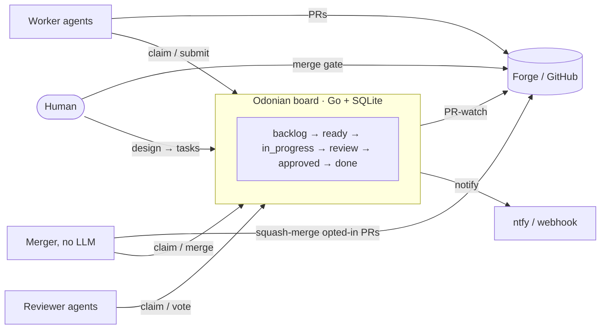

<p align="center">
  <picture>
    <source media="(prefers-color-scheme: dark)" srcset="docs/assets/logo-dark.svg">
    
  </picture>
</p>

# Odonian

[](https://github.com/boldfield/odonian/actions/workflows/ci.yml)
[](./LICENSE)

**A task board that AI agents volunteer for — and a human gate they can't get past.**

Odonian is the coordination substrate under a fleet of AI coding agents. A human decomposes a
design into bite-size tasks on a per-project board. Worker agents claim tasks **pull-model**
(nothing is ever assigned), do the work, and submit. Reviewer agents vote. By default, nothing
merges until a person says so.

It is the control plane only: a work queue with a precise state machine, atomic claiming,
lease-based crash recovery, review routing with a circuit breaker, and a set of level-triggered
reconcilers, behind a small REST API and one CLI binary. It is **not a kanban UI**. The board is a
queue with claiming primitives.

Two convictions shape the design:

- **Work is claimed, not assigned.** Agents volunteer for tasks they can do; the substrate only
  guarantees that claiming is atomic and that dependencies are honored. There is no scheduler
  handing out orders.
- **The machines labor; a human makes the living judgment.** Agents write and review every line,
  but the default path to `main` runs through a person. The gate is a state in the machine, not a
  sentence in a prompt.



> **Why "Odonian"?** From Ursula K. Le Guin's *The Dispossessed*: the Odonians of Anarres
> organize work through voluntary association — postings that workers claim because the work is
> worth doing, with no boss dispatching them. That is this system's pull model.

## Status

Odonian has run in production since June 2026. A Kubernetes fleet of workers, reviewers, and a
non-LLM merger drains boards for a dozen-plus projects. One of those projects is this repository:
198 of the 297 pull requests merged here were opened by the fleet from its own board, reviewed by a
second model, and merged by a human.

| | |
|---|---|
| Go source | 11.8k lines, 11 packages |
| Tests | 31.5k lines, 531 test functions; every push runs them plus a Docker smoke test |
| Merged pull requests | 297, of which 198 fleet-authored |
| Latest release | v0.16.0 |

It is a personal-scale substrate and wears that honestly. Known limits, in the order they would
hurt at larger scale:

- **Single replica; SQLite in WAL mode on one persistent volume.** No HA, no replication. Backup
  is whatever the volume layer provides.
- **One bearer token; no multi-tenancy.** Everyone with the token is the same principal.
- **No metrics endpoint.** Observability is structured logs plus the notifier.
- **Lease renewal is agent-driven.** The harness has no background heartbeat, so the lease TTL is
  kept generous and crash recovery is correspondingly slow.
- **Board-stall detection is specced from an incident and not yet built.** See
  [What broke](#what-broke).

## How it works

### The model

**Projects → Documents → Tasks.**

- A **project** maps to one repository.
- A **document** is a `design` (one per project) or a `feature_spec`. It lives in the repo;
  Odonian stores the ref and an optional commit pin, never the content.
- A **task** is a unit of work decomposed from a document: a spec, a pinned model, the models that
  must review it, its dependencies, and a `kind`.

Tasks carry typed **links** back to the forge: `pr`, `branch`, `commit`, `ci`, and `no_op`. Links
are indexed both ways, so a PR URL resolves to its task. The branch name is a pure function of the
task id, so every attempt and every rework of one task lands on the same branch and the same PR.

### Claiming

A claim is one conditional `UPDATE` whose `WHERE` clause is the claimability predicate:

```sql
(state = 'ready' OR (state = 'in_progress' AND lease_expires_at < now))  -- ready, or a dead lease
AND held = 0                                                             -- not pinned by an operator
AND NOT EXISTS (dependency whose state != 'done')                        -- every dependency landed
```

SQLite serializes writers, so exactly one of N concurrent claimers sees `rows affected = 1`. The
rest see `0` and are told why: not found, model mismatch, or plain conflict. The claim, its lease,
and its audit event commit in the same transaction. Leases are checked lazily inside the predicate:
a crashed agent's task becomes claimable the moment its lease lapses, with no sweeper and no reaper
race. None has been needed under a production fleet of roughly ten concurrent agents.

### States

| State | Meaning |
|---|---|
| `backlog` | Created, not yet claimable. A human promotes it. |
| `ready` | Claimable, subject to dependencies, hold, and model. |
| `in_progress` | Claimed and leased. |
| `review` | Submitted. One review task per required reviewer model is in flight. |
| `approved` | Every reviewer approved. Awaits the merge gate. |
| `blocked` | Circuit breaker or operator. Unblocking returns it to `ready` with a cleared lease. The review round is not reset yet, so a re-rejection re-trips the breaker; a fix is specced in `docs/specs/`. |
| `done` | Merged. Terminal. |
| `failed`, `abandoned` | Terminal off-ramps: retired by an operator, or PR closed unmerged. `failed` is absorbing; there is no revive. |
| `superseded` | Terminal. The recovery path for a wrong spec or approach: a replacement task is created with the same spec, dependents are re-pointed at it, and the stale attempt's PR is closed. |

Transitions are enforced in the store, not the API layer. Each automated transition (claim,
submit, review aggregation, PR-watch) has exactly one entry point; operator transitions are a
whitelist in `TransitionTask` ([`internal/store/store.go`](./internal/store/store.go)).

### Kinds, review, and the circuit breaker

- **`implement`**: the work. Pinned to a model, carries a spec, names its reviewer models. On
  submit, one `review` task is spawned per reviewer model.
- **`review`**: auto-created, points at its parent, carries a verdict when submitted.
- **`merge`**: auto-created when an `implement` task with `agent_merge=true` is approved. A
  non-LLM merger squash-merges through the forge API. Its lifecycle is
  `ready → in_progress → done` with no review step.

Review is unanimous: one reject returns the parent to `ready` with its review round incremented.
On rework, the worker must address every unaddressed review item on the PR, inline threads and
top-level comments alike: enumerate them with `odonian pr-feedback list`, acknowledge each with
`odonian pr-feedback ack` (a marker-stamped reply plus thread resolution or a 👍 reaction), and
only then can `odonian submit` succeed. It refuses while any item remains. That gate is mechanical,
in the CLI, not an instruction in a prompt. Past a per-model round threshold the **circuit breaker** fires: if
escalation is enabled for the task and a higher tier exists, the task is superseded by a copy pinned
to the next model up (`haiku → sonnet → opus` by default) and promoted straight to `ready`;
otherwise it goes to `blocked` and a human is notified.

Reviewer and worker need not share a vendor. Reviews pinned to `gpt-5.5` are dispatched through
the Codex CLI while workers run Claude via `claude -p`. Independence of reviewer from author is one
line of fleet configuration.

### The merge gate

With `agent_merge=false` (the default) an approved task waits. The human either records a verdict
with `odonian approve` / `odonian reject`, or acts on GitHub and lets the **PR-watch reconciler**
converge the board: merged → `done`; closed unmerged → `abandoned`; "changes requested" newer than
the approval → back to `ready`, with a marker comment on the PR. With `agent_merge=true` the merger
does the squash-merge after reviewer approval, with no human step.

## Operating it

### Topology

- **Server**: one pod from a distroless static image, SQLite on a persistent volume, behind an
  ingress. `replicas: 1` with a `Recreate` strategy, because SQLite is single-writer. This repo
  builds and pushes the image; the manifests are a kustomization with a namespace, PVC,
  deployment, and service in your own infrastructure repo.
- **Fleet**: its own namespace, one Deployment per kind. Workers and reviewers run a heavier
  image (Claude CLI, Codex CLI, Go/Rust/Python/C toolchains, `git`, `gh`, the harness). The
  merger is a small multi-arch image with no LLM in it, so it runs on the cheapest nodes
  (Raspberry Pis, in the reference deployment). Build inputs are in
  [`deploy/fleet/`](./deploy/fleet/README.md).
- **Interface**: the fleet never touches the database. Everything goes through the REST API via
  the `odonian` CLI. The practical capacity limit is vendor rate limits, not nodes.

### One binary

`odonian` is both the server and the client:

| Who | Commands |
|---|---|
| Server | `server` |
| Fleet | `next`, `claim`, `heartbeat`, `submit`, `pr-feedback`, `merge`, `wt-ensure` |
| Human | `pending`, `diff`, `approve`, `reject`, `promote`, `transition`, `projects`, `tasks`, `show` |

An optional terminal UI (`odonian-tui`) shows the board by state with search, filtering, and
confirm-gated archive actions. Four Claude Code skills wrap the human-facing ends of the workflow:
decompose a design onto the board, view it, operate it, and drive the merge gate. See
[`docs/skills.md`](./docs/skills.md).

### Reconcilers

All background behavior is a set of **level-triggered reconcilers** on one runner. Each tick reads
current state and acts on it. Nothing keeps a cursor, so a restart mid-tick loses nothing and a
missed tick is caught by the next one.

- **Notifier**: POSTs to a webhook for tasks that need a human (`approved`, `blocked`, and
  recently `failed`). A no-op when no URL is configured.
- **PR-watch**: for approved, human-gated tasks with a PR link, fetches PR state and review
  decisions from GitHub and applies the transitions under [The merge gate](#the-merge-gate).
  Comments it posts carry a marker so they are never mistaken for review feedback.
- **Event pruning** at startup: audit events for terminal tasks are trimmed by a retention window.
  Events for live tasks are never pruned.

### Failure modes

| Failure | What happens |
|---|---|
| Worker crashes mid-task | Lease lapses; any worker of that model can claim it. The rework lands on the same deterministic branch. |
| Worker finds the work already on `main` | Submits a `no_op` link and no PR; the reviewer verifies the claim against `main`. |
| Reviewer rejects repeatedly | Review round climbs; past the threshold the circuit breaker escalates the model tier, or blocks and pages. |
| Human requests changes on GitHub after approval | PR-watch bounces the task to `ready` and posts a marker comment; the worker must ack every open item before resubmitting. |
| PR merged or closed outside the board | PR-watch converges the task to `done` or `abandoned`. |
| Server restarts | Reconcilers re-derive from state. Writers wait on SQLite's 5s busy timeout instead of failing fast. |
| Webhook endpoint down | Logged. Level-triggered, so the next tick resends. |
| Forge token missing for an owner | Falls back to unauthenticated GitHub calls; private repos log 401/404 each cycle. |
| A task is wedged | `hold` pins it out of automated flow; `supersede` replaces it and closes its stale PR; `transition` to `blocked` or `failed` retires it. |

### What broke

On 2026-07-09 the review queue deadlocked, and nothing alerted for ten days.

The trigger was a revoked Codex refresh token: every `gpt-5.5` review dispatch failed. The
amplifier was the harness peeking at the queue head without claiming it, so the doomed task stayed
`ready` and stayed the head. Four reviewer pods re-dispatched it roughly 3,100 times each. An
`opus` review three minutes behind it in the queue was unreachable the whole time, and every
implement task dependency-blocked behind those reviews saw a healthy-looking "no claimable work".
Nothing entered `blocked` or `failed`, so the notifier had nothing to report: a fully deadlocked
board was byte-for-byte indistinguishable from an idle one.

What changed: Codex auth got `make` targets and documentation of its refresh-token rotation, and
the detection gap got a written spec with the correct signal. The obvious signal, age of the oldest
claimable task, false-positives: a task whose dependencies cleared this morning looks ten days
stale. The correct signal is board-level: claimable work exists **and** no non-terminal task has
changed within the threshold window. What is still open: building that reconciler, and removing
the peek-without-claim amplifier. Postmortem and spec:
[`docs/specs/2026-07-20-stall-detection.md`](./docs/specs/2026-07-20-stall-detection.md).

### Trust model

- An agent holds three secrets: the board's bearer token, a subscription token for its model
  vendor, and a per-owner forge token. It works in its own detached git worktree.
- `claude -p` runs with permission prompts disabled and Codex runs with
  `--sandbox danger-full-access`. That is why agents run in disposable containers or an `sbx`
  sandbox, never on a workstation that holds other credentials.
- With branch protection on `main`, the blast radius of a misbehaving agent is one branch on one
  repo and one row on the board. Reaching `main` takes either a human or an explicit per-task
  `agent_merge` opt-in.
- Forge tokens are held server-side, per GitHub owner, in a file the server reads. They are never
  stored in the database or returned by the API.
- The fleet shares one GitHub identity with its human. Agents self-identify in PR comments with
  `<model>-<role>:` markers (`haiku-worker:`, `opus-reviewer:`, `odonian-reconciler:`); that
  convention is how the tooling tells agent comments from human ones. See
  [`docs/specs/2026-08-18-pr-feedback-single-identity.md`](./docs/specs/2026-08-18-pr-feedback-single-identity.md).

## Quickstart

```bash
make build
export ODONIAN_TOKEN="your-secret-token"
./bin/odonian server            # REST API on :8080, SQLite at ./odonian.db, created on first run
```

Create a project, register a design doc, and post tasks through the [API](./docs/api.md), or let
the `odonian-breakdown` skill do it conversationally. Then point the fleet at the board, one agent
per terminal:

```bash
cd harness
export ODONIAN_URL=http://localhost:8080 ODONIAN_TOKEN=... ODONIAN_PROJECT=<id> ODONIAN_REPO=~/src/<repo>
./worker.sh worker-1
./reviewer.sh reviewer-1
```

For a self-contained throwaway demo inside an `sbx` sandbox, `bash harness/sbx.sh --seed-demo`
boots the server and a small fleet with all state under `/tmp/odonian`. The full build, server,
TUI, fleet, sandbox, and deployment reference is in [`docs/running.md`](./docs/running.md).

## Documentation

- [`docs/running.md`](./docs/running.md): build, run, test, deploy, and run the fleet locally or in a sandbox.
- [`docs/configuration.md`](./docs/configuration.md): every environment variable for the server, notifier, PR-watch, CLI, and harness.
- [`docs/api.md`](./docs/api.md): REST API reference.
- [`DESIGN.md`](./DESIGN.md): the original MVP design: state machine, atomic claiming, review semantics.
- [`harness/README.md`](./harness/README.md): the fleet engine, prompts, per-owner auth, multi-project mode.
- [`deploy/fleet/README.md`](./deploy/fleet/README.md): running the fleet on Kubernetes.
- [`docs/skills.md`](./docs/skills.md): the four Claude Code skills and how to install them.
- [`docs/specs/`](./docs/specs/): dated feature specs, including the stall postmortem.
- [`docs/features/`](./docs/features/): feature designs for the model ladder, TUI, and sandbox bootstrap.
- [`board/`](./board/README.md) and [`AGENT.md`](./AGENT.md): the text-file board and runbook used to bootstrap the first release before the API existed.

## License

[AGPL-3.0](./LICENSE). Run it, fork it, host it; if you host a modified Odonian for others, share
your changes.
