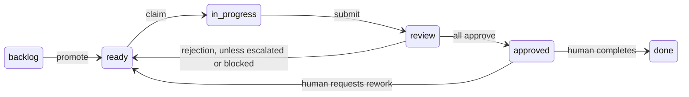

# Odonian API Reference

## Overview

The Odonian API is a RESTful coordination substrate for managing a backlog of work claimed and executed by AI agents. All endpoints (except `/healthz`) require a bearer token authentication.

Task URL paths accept full UUIDs or unique prefixes of at least eight characters; see
[Task ID Conventions](#task-id-conventions). Project IDs, document IDs, and dependency references
still require full UUIDs (or intra-batch task keys where supported).
JSON field names are lowercase (`id`, `project_id`, etc.).
The shared token authorizes access across every project and task; agent IDs identify actors
and lease owners, not separate authenticated principals.

## Authentication

All endpoints except `GET /healthz` require the `Authorization: Bearer <token>` header.

**Server Configuration:**
- `ODONIAN_TOKEN` (required): The bearer token to authenticate requests
- `ODONIAN_DB` (optional, default `odonian.db`): SQLite database path (e.g., `/data/odonian.db`)
- `ODONIAN_ADDR` (optional, default `:8080`): Server address and port

**Example:**
```bash
curl -H "Authorization: Bearer your-secret-token" https://api.example.com/projects
```

**Error Responses:**
- `401 MISSING_AUTH`: Authorization header is missing
- `401 INVALID_AUTH_FORMAT`: Authorization header is not in the format `Bearer <token>`
- `401 INVALID_TOKEN`: The provided token does not match the server token

## Endpoints

### Health Check

#### `GET /healthz`

Check server health (no authentication required).

**Request:**
```bash
curl http://localhost:8080/healthz
```

**Response (200 OK):**
```json
{
  "status": "ok"
}
```

---

### Projects

#### `POST /projects`

Create a new project.

**Request:**
```json
{
  "name": "My Project",
  "repo": "https://github.com/user/my-project"
}
```

**Response (201 Created):**
```json
{
  "id": "550e8400-e29b-41d4-a716-446655440000",
  "name": "My Project",
  "repo": "https://github.com/user/my-project",
  "created_at": "2026-06-05T21:00:00.000000000Z",
  "archived_at": null
}
```

**Status Codes:**
- `201 Created`: Project successfully created
- `400 EMPTY_NAME`: Project name cannot be empty
- `400 JSON_DECODE_ERROR`: Invalid JSON in request body
- `500 CREATE_ERROR`: Server error creating project

**Note:** The `id` field is a UUID that must be used in subsequent requests to reference this project.

---

#### `GET /projects/{id}`

Retrieve a project by ID, including an archived project.

**Request:**
```bash
curl -H "Authorization: Bearer token" \
  https://api.example.com/projects/550e8400-e29b-41d4-a716-446655440000
```

**Response (200 OK):**
```json
{
  "id": "550e8400-e29b-41d4-a716-446655440000",
  "name": "My Project",
  "repo": "https://github.com/user/my-project",
  "created_at": "2026-06-05T21:00:00.000000000Z",
  "archived_at": null
}
```

**Status Codes:**
- `200 OK`: Project found
- `404 NOT_FOUND`: Project not found
- `500 GET_ERROR`: Server error retrieving project

**Note:** The `archived_at` field is `null` for active projects or contains the timestamp when the project was archived.

---

#### `GET /projects`

List projects, ordered by creation time. Archived projects are excluded by default.

```bash
curl -H "Authorization: Bearer token" \
  'https://api.example.com/projects?claimable=true&model=haiku&kind=implement'
```

**Query Parameters:**

- `claimable=true`: Include only projects with at least one claimable, unarchived task.
- `model`: Restrict matching work to this model when `claimable=true`.
- `kind`: Restrict matching work to `implement`, `review`, or `merge` when `claimable=true`.
- `include_archived=true`: Include archived projects in the listing.
- `include_superseded=true`: Accepted by the discovery filter; superseded tasks remain
  unclaimable, so they do not cause a project to appear in claimable discovery.

**Response:** `200 OK` with an array of project objects, or `[]` if none match. Returns
`400 INVALID_KIND` for an unsupported kind and `500 LIST_ERROR` on a storage failure.

Project objects include `archived_at`: `null` for active projects and the archive timestamp
for archived projects. Use `include_archived=true` to list both, then inspect this field to
identify projects to unarchive.

#### `POST /projects/{id}/archive`

Soft-archive a project by setting `archived_at`. No request body is required.

```bash
curl -X POST -H "Authorization: Bearer token" \
  https://api.example.com/projects/550e8400-e29b-41d4-a716-446655440000/archive
```

**Response:** `200 OK` with the project object and its `archived_at` timestamp;
`404 NOT_FOUND` if absent, or `500 ARCHIVE_ERROR` on failure.

Archiving hides the project from default project listings and fleet discovery. It does not
archive its tasks, cancel active workers, or prevent direct requests using known IDs. It is
not an access control or a substitute for stopping a fleet pinned to that project.

#### `POST /projects/{id}/unarchive`

Restore a project's visibility by clearing `archived_at`. No request body is required.

```bash
curl -X POST -H "Authorization: Bearer token" \
  https://api.example.com/projects/550e8400-e29b-41d4-a716-446655440000/unarchive
```

**Response:** `200 OK` with the project object and `archived_at: null`;
`404 NOT_FOUND` if absent, or `500 UNARCHIVE_ERROR` on failure. Tasks retain their existing states.

---

### Documents

#### `POST /projects/{id}/documents`

Register a design or feature specification document.

**Request:**
```json
{
  "kind": "design",
  "title": "DESIGN.md",
  "ref": "DESIGN.md",
  "commit": "abc123def456"
}
```

**Parameters:**
- `kind` (required): Either `"design"` or `"feature_spec"`
- `title` (required): Human-readable title of the document
- `ref` (required): Repository-relative path or URL to the document
- `commit` (optional): Specific commit hash if the document is pinned to a particular version

**Response (201 Created):**
```json
{
  "id": "660e8400-e29b-41d4-a716-446655440001",
  "project_id": "550e8400-e29b-41d4-a716-446655440000",
  "kind": "design",
  "title": "DESIGN.md",
  "ref": "DESIGN.md",
  "commit": null,
  "created_at": "2026-06-05T21:00:00.000000000Z",
  "updated_at": "2026-06-05T21:00:00.000000000Z"
}
```

**Status Codes:**
- `201 Created`: Document successfully registered
- `400 INVALID_KIND`: `kind` must be `"design"` or `"feature_spec"`
- `400 JSON_DECODE_ERROR`: Invalid JSON in request body
- `404 NOT_FOUND`: Project not found
- `409 CONFLICT`: A design document already exists for this project (only one design per project allowed)
- `500 CREATE_ERROR`: Server error creating document

**Note:** Each project may have at most one `design` document, but multiple `feature_spec` documents.

---

#### `GET /projects/{id}/documents`

List all documents for a project.

**Request:**
```bash
# List all documents
curl -H "Authorization: Bearer token" \
  https://api.example.com/projects/550e8400-e29b-41d4-a716-446655440000/documents

# Filter by kind
curl -H "Authorization: Bearer token" \
  "https://api.example.com/projects/550e8400-e29b-41d4-a716-446655440000/documents?kind=design"
```

**Query Parameters:**
- `kind` (optional): Filter by `"design"` or `"feature_spec"`

**Response (200 OK):**
```json
[
  {
    "id": "660e8400-e29b-41d4-a716-446655440001",
    "project_id": "550e8400-e29b-41d4-a716-446655440000",
    "kind": "design",
    "title": "DESIGN.md",
    "ref": "DESIGN.md",
    "commit": null,
    "created_at": "2026-06-05T21:00:00.000000000Z",
    "updated_at": "2026-06-05T21:00:00.000000000Z"
  }
]
```

**Status Codes:**
- `200 OK`: Documents retrieved
- `500 LIST_ERROR`: Server error listing documents

---

### Tasks

#### Task ID Conventions

Task ids are 36-character UUIDs, but table output (CLI, TUI) truncates them to
8 characters for readability. Every task-id route — `GET /tasks/{id}` and each
`/tasks/{id}/...` operation (claim, heartbeat, promote, submit, review,
transition, supersede, hold, release, archive, unarchive, events, and `PATCH
/tasks/{id}`) — accepts either the full id or any unique prefix of at least 8
characters, so a truncated id copied from a table can be used directly without
a `--json | jq` round trip to recover the full UUID:

- **Exact id** (36 characters): looked up as-is.
- **Unique prefix** (8-35 characters) matching exactly one task: resolved to
  that task.
- **No matching prefix**: `404 NOT_FOUND`.
- **Several matches**: `409 AMBIGUOUS_ID`, with the candidate ids listed in
  `error.candidates`.
- **Fewer than 8 characters**: always `404 NOT_FOUND` (too short to safely
  disambiguate).

The prefix is matched literally: `%` and `_` are not treated as SQL wildcards,
so a prefix such as `________` resolves to `404 NOT_FOUND` rather than matching
every task.

Resolution covers all tasks on the board, including archived and superseded tasks; it is not
scoped to the project currently displayed. Use a longer prefix or the full UUID on ambiguity.
IDs in response bodies remain full UUIDs. Prefix support applies to task IDs in URL paths,
not to project/document IDs or task IDs inside `depends_on` arrays.

**CLI local-worktree limitation:** `show` and `diff` can use a unique task prefix. In
`local_commit` mode, continue using full UUIDs for `wt-ensure`, implement-task `submit`,
`approve`, and `reject --abandon`: their filesystem operations still construct worktree and
`wip/<id>` names from the argument as typed. A prefix can resolve on the board but fail to find
the full-ID worktree or branch. The [demo](./demo.md#4-inspect-the-work-and-decide) uses full IDs.

#### `POST /projects/{id}/tasks`

Bulk-create tasks for a project.

**Request:**
```json
[
  {
    "key": "task1",
    "title": "Implement authentication",
    "spec": "Add bearer token authentication to all endpoints",
    "document_id": "660e8400-e29b-41d4-a716-446655440001",
    "model": "haiku",
    "review_models": ["opus", "sonnet"]
  },
  {
    "key": "task2",
    "title": "Add task claiming",
    "spec": "Implement atomic task claiming with leases",
    "document_id": "660e8400-e29b-41d4-a716-446655440001",
    "model": "haiku",
    "depends_on": ["task1"]
  }
]
```

**Parameters (per task):**
- `key` (optional): Client-provided unique key for referencing this task within the batch (for `depends_on`)
- `title` (required): Task title
- `spec` (required): Task specification/description
- `document_id` (required): ID of the design or feature document this task is decomposed from
- `model` (optional): Assigned model (e.g., `haiku`, `sonnet`, `opus`); must be in the deployment allowlist if provided. If omitted or empty, defaults to the deployment default model.
- `review_models` (optional): List of reviewer models for this task (e.g., `["opus", "sonnet"]`); each must be in the allowlist. Default is `["opus"]` if unset/empty. Ignored for review tasks (auto-spawned only).
- `depends_on` (optional): Array of task IDs or keys (if using intra-batch references) that must be done before this task is claimable
- `agent_merge` (optional, default `false`): Allow automatic completion after review; for work with a PR, spawn a non-LLM merge task.
- `escalate` (optional, default `true`): Allow replacement by a higher model tier after the review threshold is exceeded.
- `track` (optional, default `build`): `build`, `design`, or `research`; other values return `400 UNKNOWN_TRACK`. Omitted or empty values default to `build`. The track selects the harness prompt directory; supported delivery combinations are listed below.

| Delivery mode | Supported tracks |
|---|---|
| `pull_request` | `build`, `design` |
| `local_commit` | `build` |

These combinations have worker and reviewer prompts in the bundled harness. The API validates
the track name, but delivery mode is a harness setting: `design` is accepted even when a slot
uses `local_commit`. If the selected prompt file is missing, the harness transitions the task
to `blocked` with a `no prompt for <delivery-mode>/<track>/<kind>: <path>` note, logs the missing
file, and sleeps 30 seconds before continuing. Once blocked, the task no longer prevents later
claimable work from being selected. Supply the missing prompt or use a compatible delivery
mode, then transition `blocked` → `ready` to retry. Supersession preserves the track, so merely
superseding the task will not resolve a missing prompt.

**Response (201 Created):**
```json
[
  {
    "id": "770e8400-e29b-41d4-a716-446655440002",
    "project_id": "550e8400-e29b-41d4-a716-446655440000",
    "document_id": "660e8400-e29b-41d4-a716-446655440001",
    "title": "Implement authentication",
    "spec": "Add bearer token authentication to all endpoints",
    "state": "backlog",
    "kind": "implement",
    "model": "haiku",
    "review_models": ["opus", "sonnet"],
    "review_round": 0,
    "assignee": null,
    "lease_expires_at": null,
    "result": null,
    "created_at": "2026-06-05T21:00:00.000000000Z",
    "updated_at": "2026-06-05T21:00:00.000000000Z"
  },
  {
    "id": "880e8400-e29b-41d4-a716-446655440003",
    "project_id": "550e8400-e29b-41d4-a716-446655440000",
    "document_id": "660e8400-e29b-41d4-a716-446655440001",
    "title": "Add task claiming",
    "spec": "Implement atomic task claiming with leases",
    "state": "backlog",
    "kind": "implement",
    "model": "haiku",
    "review_models": ["opus"],
    "review_round": 0,
    "assignee": null,
    "lease_expires_at": null,
    "result": null,
    "created_at": "2026-06-05T21:00:00.000000000Z",
    "updated_at": "2026-06-05T21:00:00.000000000Z"
  }
]
```

**Status Codes:**
- `201 Created`: Tasks successfully created
- `400 INVALID_DOCUMENT_ID`: One or more document IDs do not exist
- `400 UNKNOWN_MODEL`: The `model` or a `review_models` entry is not in the deployment allowlist
- `400 UNKNOWN_TRACK`: The `track` field is not one of `"build"`, `"design"`, or `"research"`
- `400 JSON_DECODE_ERROR`: Invalid JSON in request body
- `400 <other validation errors>`: Client input validation errors
- `500 CREATE_ERROR`: Server error creating tasks

**Note:** All tasks begin in the `backlog` state and must be promoted to `ready` before they can be claimed. All tasks default to `kind: implement` if not auto-spawned as review tasks.

---

#### `GET /projects/{id}/tasks`

List tasks for a project with optional filters.

**Request:**
```bash
# List all tasks
curl -H "Authorization: Bearer token" \
  https://api.example.com/projects/550e8400-e29b-41d4-a716-446655440000/tasks

# Filter by state
curl -H "Authorization: Bearer token" \
  "https://api.example.com/projects/550e8400-e29b-41d4-a716-446655440000/tasks?state=in_progress"

# Filter by model
curl -H "Authorization: Bearer token" \
  "https://api.example.com/projects/550e8400-e29b-41d4-a716-446655440000/tasks?model=haiku"

# Filter by kind
curl -H "Authorization: Bearer token" \
  "https://api.example.com/projects/550e8400-e29b-41d4-a716-446655440000/tasks?kind=implement"

# Filter by assignee
curl -H "Authorization: Bearer token" \
  "https://api.example.com/projects/550e8400-e29b-41d4-a716-446655440000/tasks?assignee=agent-1"

# Filter by claimable and model (worker polls for its own work)
curl -H "Authorization: Bearer token" \
  "https://api.example.com/projects/550e8400-e29b-41d4-a716-446655440000/tasks?claimable=true&model=haiku"

# Return summary view (omit spec and result)
curl -H "Authorization: Bearer token" \
  "https://api.example.com/projects/550e8400-e29b-41d4-a716-446655440000/tasks?fields=summary"
```

**Query Parameters:**
- `state` (optional): Filter by task state (`backlog`, `ready`, `in_progress`, `review`, `approved`, `done`, `blocked`, `failed`, `superseded`, `abandoned`)
- `model` (optional): Filter by assigned model (e.g., `haiku`, `sonnet`, `opus`)
- `kind` (optional): Filter by task kind (`implement`, `review`, or `merge`)
- `assignee` (optional): Filter by agent ID
- `claimable` (optional): If `true`, only return tasks in `ready`, or `in_progress` with an expired lease, that are not held and have all dependencies done.
- `include_archived` (optional): If `true`, include archived tasks; otherwise they are hidden.
- `include_superseded` (optional): If `true`, include superseded tasks; otherwise they are hidden even when filtering by `state=superseded`.
- `fields` (optional): `summary` omits `spec` and `result` while retaining the other task fields. Omitted or unrecognized values return the full listing representation. Fetch `GET /tasks/{id}` for the full task with dependencies and links.

**Response (200 OK):**

Without `fields=summary`:
```json
[
  {
    "id": "770e8400-e29b-41d4-a716-446655440002",
    "project_id": "550e8400-e29b-41d4-a716-446655440000",
    "document_id": "660e8400-e29b-41d4-a716-446655440001",
    "title": "Implement authentication",
    "spec": "Add bearer token authentication to all endpoints",
    "state": "ready",
    "kind": "implement",
    "model": "haiku",
    "review_models": ["opus"],
    "review_round": 0,
    "assignee": null,
    "lease_expires_at": null,
    "result": null,
    "created_at": "2026-06-05T21:00:00.000000000Z",
    "updated_at": "2026-06-05T21:00:00.000000000Z"
  }
]
```

With `fields=summary` (omits `spec` and `result`):
```json
[
  {
    "id": "770e8400-e29b-41d4-a716-446655440002",
    "project_id": "550e8400-e29b-41d4-a716-446655440000",
    "document_id": "660e8400-e29b-41d4-a716-446655440001",
    "title": "Implement authentication",
    "state": "ready",
    "kind": "implement",
    "model": "haiku",
    "review_models": ["opus"],
    "review_round": 0,
    "assignee": null,
    "lease_expires_at": null,
    "created_at": "2026-06-05T21:00:00.000000000Z",
    "updated_at": "2026-06-05T21:00:00.000000000Z"
  }
]
```

**Status Codes:**
- `200 OK`: Tasks retrieved
- `500 LIST_ERROR`: Server error listing tasks

**Note:** Response contains an empty array if no tasks match the filters. Claims require `ready`
or an expired `in_progress` lease, `held=false`, and every dependency in `done`. All tasks have a
`kind` and a `model`; review and merge tasks have a `target_task_id` pointing to their parent.

---

#### `GET /tasks/{id}`

Retrieve a task with its dependencies and links.

**Request:**
```bash
curl -H "Authorization: Bearer token" \
  https://api.example.com/tasks/770e8400-e29b-41d4-a716-446655440002
```

**Response (200 OK):**
```json
{
  "id": "770e8400-e29b-41d4-a716-446655440002",
  "project_id": "550e8400-e29b-41d4-a716-446655440000",
  "document_id": "660e8400-e29b-41d4-a716-446655440001",
  "title": "Implement authentication",
  "spec": "Add bearer token authentication to all endpoints",
  "state": "done",
  "kind": "implement",
  "model": "haiku",
  "review_models": ["opus"],
  "review_round": 1,
  "target_task_id": null,
  "assignee": "agent-1",
  "lease_expires_at": null,
  "result": "Completed successfully",
  "created_at": "2026-06-05T21:00:00.000000000Z",
  "updated_at": "2026-06-05T21:05:00.000000000Z",
  "depends_on": [
    "770e8400-e29b-41d4-a716-446655440000"
  ],
  "links": [
    {
      "id": "990e8400-e29b-41d4-a716-446655440004",
      "task_id": "770e8400-e29b-41d4-a716-446655440002",
      "kind": "pr",
      "value": "#123"
    },
    {
      "id": "aa0e8400-e29b-41d4-a716-446655440005",
      "task_id": "770e8400-e29b-41d4-a716-446655440002",
      "kind": "commit",
      "value": "abc123def456"
    }
  ]
}
```

**Status Codes:**
- `200 OK`: Task retrieved
- `404 NOT_FOUND`: Task not found (including an id prefix with no matches, or shorter than 8 characters)
- `409 AMBIGUOUS_ID`: The id prefix matches more than one task; `error.candidates` lists the matching ids
- `500 GET_ERROR`: Server error retrieving task

**Note:** This endpoint returns lowercase field names, the full dependency list, and linked
resources. `{id}` accepts a unique prefix — see [Task ID Conventions](#task-id-conventions).

---

#### `POST /tasks/{id}/promote`

Promote a task from `backlog` to `ready` state.

**Request:**
```bash
curl -X POST -H "Authorization: Bearer token" \
  https://api.example.com/tasks/770e8400-e29b-41d4-a716-446655440002/promote
```

**Response (200 OK):**
```json
{
  "id": "770e8400-e29b-41d4-a716-446655440002",
  "project_id": "550e8400-e29b-41d4-a716-446655440000",
  "document_id": "660e8400-e29b-41d4-a716-446655440001",
  "title": "Implement authentication",
  "spec": "Add bearer token authentication to all endpoints",
  "state": "ready",
  "kind": "implement",
  "model": "haiku",
  "review_models": ["opus"],
  "review_round": 0,
  "assignee": null,
  "lease_expires_at": null,
  "result": null,
  "created_at": "2026-06-05T21:00:00.000000000Z",
  "updated_at": "2026-06-05T21:00:30.000000000Z"
}
```

**Status Codes:**
- `200 OK`: Task promoted successfully
- `404 NOT_FOUND`: Task not found
- `409 CONFLICT`: Task is not in backlog state
- `500 PROMOTE_ERROR`: Server error promoting task

**Note:** Promotion is the human's gate — only promoted tasks can be claimed by agents.

---

#### `POST /tasks/{id}/claim`

Claim a task and move it to `in_progress` state with a lease.

**Request:**
```json
{
  "agent_id": "agent-1",
  "model": "haiku"
}
```

**Parameters:**
- `agent_id` (required): The ID of the agent claiming the task (non-empty string)
- `model` (required): The model assigned to the claiming agent (e.g., `haiku`, `sonnet`, `opus`); must match the task's model

**Response (200 OK):**
```json
{
  "id": "770e8400-e29b-41d4-a716-446655440002",
  "project_id": "550e8400-e29b-41d4-a716-446655440000",
  "document_id": "660e8400-e29b-41d4-a716-446655440001",
  "title": "Implement authentication",
  "spec": "Add bearer token authentication to all endpoints",
  "state": "in_progress",
  "kind": "implement",
  "model": "haiku",
  "review_models": ["opus"],
  "review_round": 0,
  "assignee": "agent-1",
  "lease_expires_at": "2026-06-05T21:05:00.000000000Z",
  "result": null,
  "created_at": "2026-06-05T21:00:00.000000000Z",
  "updated_at": "2026-06-05T21:01:00.000000000Z"
}
```

**Status Codes:**
- `200 OK`: Task claimed successfully
- `400 EMPTY_AGENT_ID`: agent_id cannot be empty
- `400 EMPTY_MODEL`: model cannot be empty
- `400 JSON_DECODE_ERROR`: Invalid JSON in request body
- `404 NOT_FOUND`: Task not found
- `409 CONFLICT`: Task is not claimable (not in ready state, has an active lease, or has undone dependencies)
- `409 MODEL_MISMATCH`: The task's model does not match the declared model
- `500 CLAIM_ERROR`: Server error claiming task

**Claimability Rules:**
A task is claimable only if:
1. It is in the `ready` state
2. No active lease exists (or the lease has expired)
3. All tasks in its `depends_on` set are in the `done` state
4. The task's `model` matches the agent's declared model (server enforced)

The claim is atomic — implemented as a conditional UPDATE statement. If the claim succeeds, `rowsAffected == 1` and the task is guaranteed to be in `in_progress` with a fresh lease. If `rowsAffected == 0`, the client lost the race (another agent claimed it first) or the model didn't match, and should retry with a different task.

---

#### `POST /tasks/{id}/heartbeat`

Extend the lease on a task claimed by an agent.

**Request:**
```json
{
  "agent_id": "agent-1"
}
```

**Parameters:**
- `agent_id` (required): The ID of the agent (must match the task's assignee)

**Response (200 OK):**
```json
{
  "id": "770e8400-e29b-41d4-a716-446655440002",
  "project_id": "550e8400-e29b-41d4-a716-446655440000",
  "document_id": "660e8400-e29b-41d4-a716-446655440001",
  "title": "Implement authentication",
  "spec": "Add bearer token authentication to all endpoints",
  "state": "in_progress",
  "kind": "implement",
  "model": "haiku",
  "review_models": ["opus"],
  "review_round": 0,
  "assignee": "agent-1",
  "lease_expires_at": "2026-06-05T21:10:00.000000000Z",
  "result": null,
  "created_at": "2026-06-05T21:00:00.000000000Z",
  "updated_at": "2026-06-05T21:02:00.000000000Z"
}
```

**Status Codes:**
- `200 OK`: Heartbeat successful, lease extended
- `400 EMPTY_AGENT_ID`: agent_id cannot be empty
- `400 JSON_DECODE_ERROR`: Invalid JSON in request body
- `404 NOT_FOUND`: Task not found
- `409 CONFLICT`: Task is not in_progress or is not assigned to the provided agent_id
- `500 HEARTBEAT_ERROR`: Server error extending lease

**Note:** Agents should call this regularly (at least before the lease expires) to prevent the task from becoming claimable by another agent. The lease duration is configured on the server side.

---

#### `POST /tasks/{id}/submit`

Submit a task for review (implement tasks) or submit a verdict (review tasks). Behavior depends on task kind.

**For `kind: implement` tasks** — Submit for review with work links:

**Request:**
```json
{
  "agent_id": "agent-1",
  "result": "Task completed successfully. Implemented bearer token auth on all endpoints.",
  "links": [
    {
      "kind": "pr",
      "value": "#123"
    },
    {
      "kind": "commit",
      "value": "abc123def456"
    }
  ]
}
```

**Parameters:**
- `agent_id` (required): The ID of the agent submitting (must match the task's assignee)
- `result` (required): Summary of work completed
- `links` (optional): Array of external resource references
- `verdict` (forbidden): Must not be present for implement tasks

**Link Types:**
- `pr`: Pull request reference (e.g., `#123` or `owner/repo#123`)
- `commit`: Commit hash (e.g., `abc123def456`)
- `branch`: Branch name (e.g., `feature/auth`)
- `ci`: CI status/build URL (e.g., `https://ci.example.com/builds/123`)
- `no_op`: Review-verified no-op marker (e.g., `already-satisfied`). Used when the acceptance
  criteria are already satisfied on `main` with no diff: the worker submits with this marker and
  NO `pr` link, and the reviewer verifies the claim against `main` before approving.

**Response (200 OK):**
```json
{
  "id": "770e8400-e29b-41d4-a716-446655440002",
  "project_id": "550e8400-e29b-41d4-a716-446655440000",
  "document_id": "660e8400-e29b-41d4-a716-446655440001",
  "title": "Implement authentication",
  "spec": "Add bearer token authentication to all endpoints",
  "state": "review",
  "kind": "implement",
  "model": "haiku",
  "review_models": ["opus"],
  "review_round": 1,
  "assignee": "agent-1",
  "lease_expires_at": null,
  "result": "Task completed successfully. Implemented bearer token auth on all endpoints.",
  "created_at": "2026-06-05T21:00:00.000000000Z",
  "updated_at": "2026-06-05T21:03:00.000000000Z",
  "depends_on": [],
  "links": [
    {
      "id": "990e8400-e29b-41d4-a716-446655440004",
      "task_id": "770e8400-e29b-41d4-a716-446655440002",
      "kind": "pr",
      "value": "#123"
    },
    {
      "id": "aa0e8400-e29b-41d4-a716-446655440005",
      "task_id": "770e8400-e29b-41d4-a716-446655440002",
      "kind": "commit",
      "value": "abc123def456"
    }
  ]
}
```

---

**For `kind: review` tasks** — Submit a verdict:

**Request:**
```json
{
  "agent_id": "opus-reviewer-1",
  "verdict": "approve",
  "result": "Code review passed. Well-structured and thoroughly tested. One minor comment on error handling."
}
```

**Parameters:**
- `agent_id` (required): The ID of the reviewing agent (must match the task's assignee)
- `verdict` (required): Either `"approve"` or `"reject"`
- `result` (optional): Review writeup or detailed feedback

**Response (200 OK):**
```json
{
  "id": "aa0e8400-e29b-41d4-a716-446655440006",
  "project_id": "550e8400-e29b-41d4-a716-446655440000",
  "document_id": "660e8400-e29b-41d4-a716-446655440001",
  "title": "Review: Implement authentication [opus]",
  "spec": "...",
  "state": "done",
  "kind": "review",
  "model": "opus",
  "review_models": null,
  "review_round": 1,
  "target_task_id": "770e8400-e29b-41d4-a716-446655440002",
  "assignee": "opus-reviewer-1",
  "lease_expires_at": null,
  "result": "Code review passed. Well-structured and thoroughly tested. One minor comment on error handling.",
  "created_at": "2026-06-05T21:03:00.000000000Z",
  "updated_at": "2026-06-05T21:04:30.000000000Z"
}
```

The response includes the review task's own `id` and the parent implement task's `id` in `target_task_id`. If this verdict completes the current review round (all reviewers have verdicted), the parent task will also be automatically transitioned:
- All approve → parent moves to `approved`
- Any reject → parent moves to `ready` for rework

---

**Status Codes (both kinds):**
- `200 OK`: Submit successful
- `400 EMPTY_AGENT_ID`: agent_id cannot be empty
- `400 INVALID_LINK_KIND`: One or more link kinds are invalid (must be pr, branch, commit, ci, or no_op)
- `400 INVALID_VERDICT`: verdict must be "approve" or "reject" (review only)
- `400 FORBIDDEN_VERDICT`: verdict must not be present for implement tasks
- `400 MISSING_VERDICT`: verdict is required for review tasks
- `400 JSON_DECODE_ERROR`: Invalid JSON in request body
- `404 NOT_FOUND`: Task not found
- `409 CONFLICT`: Task is not in_progress or is not assigned to the provided agent_id
- `500 SUBMIT_ERROR`: Server error submitting task

**Note:** Links are indexed on `(kind, value)` to enable reverse lookup. Review verdicts are recorded as events on the parent implement task for audit purposes.

---

#### `POST /tasks/{id}/review`

Post a review verdict on a task in the `review` state.

**Request:**
```json
{
  "actor": "reviewer@example.com",
  "verdict": "approve",
  "note": "Looks good! Code quality is solid."
}
```

**Parameters:**
- `actor` (required): Human-readable identifier of the reviewer (non-empty string)
- `verdict` (required): Either `"approve"` or `"reject"`
- `note` (optional): Free-form note or feedback

**Response (201 Created):**
```json
{
  "id": "bb0e8400-e29b-41d4-a716-446655440006",
  "task_id": "770e8400-e29b-41d4-a716-446655440002",
  "actor": "reviewer@example.com",
  "kind": "review",
  "verdict": "approve",
  "note": "Looks good! Code quality is solid.",
  "created_at": "2026-06-05T21:04:00.000000000Z"
}
```

**Status Codes:**
- `201 Created`: Review event recorded
- `400 EMPTY_ACTOR`: actor cannot be empty
- `400 INVALID_VERDICT`: verdict must be "approve" or "reject"
- `400 JSON_DECODE_ERROR`: Invalid JSON in request body
- `404 NOT_FOUND`: Task not found
- `409 CONFLICT`: Task is not in review state
- `500 REVIEW_ERROR`: Server error recording review

**Note:** Review events are immutable and append-only. They do not directly transition the task state — that is done via a separate `POST /tasks/{id}/transition` call. If verdict is `reject`, the task typically transitions back to `ready` for rework.

---

#### `POST /tasks/{id}/transition`

Transition a task to a new state (manual state machine operation). Typically used by humans
to drain the `approved` lane by merging and marking done, or to override an approval.

**Request:**
```json
{
  "to": "done",
  "note": "Reviewed and merged to main"
}
```

**Parameters:**
- `to` (required): Target state (`done`, `blocked`, `ready`, `failed`, `superseded`, or `abandoned`)
- `note` (optional): Reason or context for the transition

**Response (200 OK):**
```json
{
  "id": "770e8400-e29b-41d4-a716-446655440002",
  "project_id": "550e8400-e29b-41d4-a716-446655440000",
  "document_id": "660e8400-e29b-41d4-a716-446655440001",
  "title": "Implement authentication",
  "spec": "Add bearer token authentication to all endpoints",
  "state": "done",
  "kind": "implement",
  "model": "haiku",
  "review_models": ["opus"],
  "review_round": 1,
  "assignee": "agent-1",
  "lease_expires_at": null,
  "result": "Task completed successfully. Implemented bearer token auth on all endpoints.",
  "created_at": "2026-06-05T21:00:00.000000000Z",
  "updated_at": "2026-06-05T21:05:00.000000000Z"
}
```

**Status Codes:**
- `200 OK`: Task transitioned successfully
- `400 INVALID_STATE`: Target state is invalid
- `400 JSON_DECODE_ERROR`: Invalid JSON in request body
- `404 NOT_FOUND`: Task not found
- `409 CONFLICT`: Transition is not allowed from the current state
- `500 TRANSITION_ERROR`: Server error transitioning task

**Valid Transitions:**
The state machine enforces these rules:
- `ready` → `in_progress` (via claim)
- `in_progress` → `review` (via submit for implement tasks)
- `review` → `approved` (when all reviewers approve; via the final verdict, or release after a held round finishes)
- `review` → `done` (automatic after unanimous approval when `agent_merge=true`, a `no_op` link exists, and no `pr` link exists)
- `review` → `ready` (once every review finishes and at least one rejects, unless the circuit breaker escalates or blocks the task)
- `approved` → `done` (human merges PR)
- `approved` → `ready` (human disagrees with reviewers, requests rework)
- `blocked` → `ready` (human unblocks / retries; clears stale assignee and lease)
- `blocked` → `failed` (retire a dead blocked task without re-entering the queue)
- Any active state → `blocked` (off-ramp: external blocker)
- Any active state → `failed` (off-ramp: task cannot be done as specified)
- Any active state → `superseded` (retire without creating a replacement; use `/supersede` to create one)
- `approved` → `abandoned` (retire without merging)
- `in_progress` → `done` for `merge` tasks only

The operator `/transition` endpoint does not permit `review` → `done`. Review aggregation does
perform that direct transition for the opted-in no-op case above, in a single update; the parent
never enters `approved` and will not appear in a script that drains that lane. A no-op task with
`agent_merge=false` still waits in `approved` for a human decision. Merge subtasks instead go
from `in_progress` to `done` after merging.

`blocked` is recoverable via `blocked` → `ready`; use `blocked` → `failed` to retire it.
The `/transition` endpoint cannot move a task out of `done`, `failed`, `superseded`, or `abandoned`.
The separate `/supersede` endpoint also rejects these terminal states with `409 CONFLICT`.

---

### Task events and operator actions

#### `GET /tasks/{id}/events`

Return the task's retained audit events, oldest first, ordered by `created_at` and then `id`.

```bash
curl -H "Authorization: Bearer token" \
  https://api.example.com/tasks/770e8400-e29b-41d4-a716-446655440002/events
```

**Response (200 OK):**

```json
[
  {
    "id": "990e8400-e29b-41d4-a716-446655440004",
    "task_id": "770e8400-e29b-41d4-a716-446655440002",
    "actor": "haiku-1",
    "kind": "claim",
    "verdict": null,
    "note": null,
    "created_at": "2026-06-05T21:00:00.000000000Z"
  }
]
```

Returns `[]` when there are no retained events, including for an unknown full-length task UUID.
An unmatched or too-short prefix returns `404 NOT_FOUND`; an ambiguous prefix returns
`409 AMBIGUOUS_ID`. Use `GET /tasks/{id}` to check existence when passing a full UUID.
Storage failures return `500 GET_ERROR`.
See [event retention configuration](./configuration.md#server-odonian-server).

#### `PATCH /tasks/{id}`

Replace the task's complete dependency list. This endpoint currently updates only dependencies;
it does not edit the title, spec, model, or other task fields.

```bash
curl -X PATCH -H "Authorization: Bearer token" -H 'Content-Type: application/json' \
  https://api.example.com/tasks/770e8400-e29b-41d4-a716-446655440002 \
  -d '{"depends_on":["880e8400-e29b-41d4-a716-446655440003"]}'
```

Use full existing task UUIDs inside `depends_on`; the URL's task ID can be a unique prefix.
`{"depends_on":[]}` clears dependencies; omitting `depends_on`
or setting it to `null` also clears the list. Unknown JSON fields are ignored, so sending only
an unsupported field would clear dependencies too. Send an explicit `depends_on` array.

**Response:** `200 OK` with the task object. Fetch `GET /tasks/{id}` to read back `depends_on`;
the PATCH response does not include the dependency list. Errors include `400 SELF_DEPENDENCY`,
`400 JSON_DECODE_ERROR`, `409 CYCLE_DETECTED`, and `404 NOT_FOUND` for a missing task with an
empty replacement list. Invalid dependency IDs, duplicates, or other storage failures currently
return `500 UPDATE_ERROR`.

#### `PATCH /tasks/{id}/escalation`

Update the task's automatic escalation policy. This endpoint controls whether the task **may** be
escalated to a higher-capacity model if needed, independent of the task's initial model assignment.

**Model assignment and escalation are separate concerns:**
- **Initial model**: The model chosen when the task is created (e.g., Haiku, Sonnet). This sizing
  decision is based on task complexity and is immutable.
- **Escalation permission** (the `escalate` field): A boolean policy flag controlling whether the
  task may be automatically promoted to a higher-capacity model if the assigned model runs out of
  capacity or if review feedback indicates that additional capability is needed. Enabled by default.
- **Task resumption/escalation** (a separate action): The act of actually promoting a task to a
  higher model occurs exclusively through the automated circuit breaker: when a rejected task's
  review round exceeds the threshold and `escalate` is true, the task is superseded onto the next
  model tier. There is no manual endpoint to escalate a task's model tier; `/tasks/{id}/promote`
  is unrelated — it moves a task from `backlog` to `ready` and does not change its model.
  Changing the `escalate` setting here does NOT immediately resume or escalate a task.

```bash
curl -X PATCH -H "Authorization: Bearer token" -H 'Content-Type: application/json' \
  https://api.example.com/tasks/770e8400-e29b-41d4-a716-446655440002/escalation \
  -d '{"escalate":true}'
```

The request requires exactly one field, `escalate`, and it must be a boolean (`true` or `false`).
Missing, null, non-boolean, or unknown fields are rejected with `400 BAD_REQUEST`. Omitting the
field, setting it to `null`, or sending an unrecognized field all fail validation without
mutating the task.

**Response:** `200 OK` with the task object showing the new escalation policy. The field `escalate`
in the response indicates the current policy. Repeating the same value is idempotent. Errors
include `400 MISSING_FIELD`, `400 NULL_FIELD`, `400 INVALID_FIELD_TYPE`, `400 UNKNOWN_FIELD`,
`400 JSON_DECODE_ERROR`, `409 CONFLICT` for a task in a disallowed terminal state (e.g., `done`,
`failed`, `abandoned`), and `404 NOT_FOUND` for a missing task.

Changing the escalation policy does not change the task's initial model, current state, lease,
review round, dependencies, history, or PR links. A blocked task may still update its escalation
policy.

#### `POST /tasks/{id}/supersede`

Create a replacement task and atomically repoint dependents to it. The old task becomes
`superseded` with `superseded_by` set to the new ID. The replacement starts in `backlog` with
review round zero, copies the title, spec, model, reviewer models, track, merge/escalation settings,
and upstream dependencies, and appends prior rejection feedback to the spec when present.

Supersession accepts `backlog`, `ready`, `in_progress`, `review`, `approved`, and `blocked` tasks.
It rejects `done`, `failed`, `abandoned`, and already `superseded` tasks with `409 CONFLICT`,
leaving their dependencies unchanged. Track is preserved for both manual supersession and
circuit-breaker escalation, so a design task's replacement still uses design prompts.

```bash
curl -X POST -H "Authorization: Bearer token" -H 'Content-Type: application/json' \
  https://api.example.com/tasks/770e8400-e29b-41d4-a716-446655440002/supersede \
  -d '{"model":"sonnet"}'
```

`model` is optional and must be in the server's allowlist. Send `{}` to keep the current model;
a JSON body is required. The replacement must be promoted separately. This operator endpoint
differs from circuit-breaker escalation, which automatically promotes its replacement.

**Response:** `201 Created` with the **new task**, including its full UUID. Returns
`400 UNKNOWN_MODEL`, `400 JSON_DECODE_ERROR`, `404 NOT_FOUND`, `409 CONFLICT` for a terminal
task, or `500 SUPERSEDE_ERROR`.

After the board transaction commits, the server attempts to close the old task's open PR and
delete its head branch using its per-owner forge token. If the file or matching token is
missing or empty, cleanup is skipped without any GitHub requests and one log line identifies
the owner and PR. There is no `gh` or `GH_TOKEN` fallback. Cleanup runs asynchronously;
a successful response confirms the board change, not completion of GitHub
cleanup. PR-watch retries stale open PR cleanup on later passes only when it has a matching
owner token. Supersession does not stop a running agent process.

#### `POST /tasks/{id}/hold`

Set `held=true` without changing the task state or lease. No request body is required.

```bash
curl -X POST -H "Authorization: Bearer token" \
  https://api.example.com/tasks/770e8400-e29b-41d4-a716-446655440002/hold
```

Held tasks cannot be claimed, and reviewer submission skips automatic aggregation for a held
parent. Holding does not terminate an already running worker or revoke its lease; it is not a
general ban on API transitions or forge actions.

Reviewers may finish while their parent is held. The parent stays in `review` until released;
`/release` applies the completed round's verdicts in the same transaction as clearing the hold.

**Response:** `200 OK` with the task object and `held: true`; `404 NOT_FOUND` if absent,
or `500 HOLD_ERROR` on failure.

#### `POST /tasks/{id}/release`

Clear `held` and, for a parent in `review` whose current round is complete, apply the review
verdicts in the same transaction. No request body is required.

```bash
curl -X POST -H "Authorization: Bearer token" \
  https://api.example.com/tasks/770e8400-e29b-41d4-a716-446655440002/release
```

If every review in the current round is done, release uses the same aggregation rules as
review submission: unanimous approval moves the parent to `approved` (or directly to `done`
for an opted-in no-op); rejection returns it to `ready`, escalates it, or blocks it according
to the circuit breaker. Release itself does not increment `review_round`; the next implement
submission starts a new round. A parent held through the final verdict needs only `/release`,
not another implement pass, to apply that verdict.

Outside `review`, or while reviews are unfinished, release only clears the hold. It does not
revoke a lease or unclaim the task. Claimability still depends on state, dependencies, and lease expiry.

**Response:** `200 OK` with the task object and `held: false`; `404 NOT_FOUND` if absent,
or `500 RELEASE_ERROR` on failure.

#### `POST /tasks/{id}/archive`

Set `archived_at` to hide a task from default task listings and discovery. No request body is required.

```bash
curl -X POST -H "Authorization: Bearer token" \
  https://api.example.com/tasks/770e8400-e29b-41d4-a716-446655440002/archive
```

**Response:** `200 OK` with the task object and its `archived_at` timestamp;
`404 NOT_FOUND` if absent, or `500 ARCHIVE_ERROR` on failure.

Archiving preserves the task, state, dependencies, and links. It does not complete the task,
satisfy dependents, stop an active worker, or prevent direct requests using the task UUID.

#### `POST /tasks/{id}/unarchive`

Clear `archived_at` to restore default listing visibility. No request body is required.

```bash
curl -X POST -H "Authorization: Bearer token" \
  https://api.example.com/tasks/770e8400-e29b-41d4-a716-446655440002/unarchive
```

**Response:** `200 OK` with the task object and `archived_at: null`;
`404 NOT_FOUND` if absent, or `500 UNARCHIVE_ERROR` on failure. The task keeps its existing state.

---

## Full Lifecycle Walkthrough

This exercises the API against a running server with the default `haiku`, `sonnet`, `opus` model allowlist.
Save the Bash block to a file and run it with `bash`; it stops on HTTP errors or missing IDs.
Set `ODONIAN_URL` and `ODONIAN_TOKEN` to your test server, or use the defaults below.

The script sends example worker and reviewer requests itself. It does not invoke an LLM,
create commits, open a PR, or merge code; the repository, PR link, and verdicts are example data.
Use a throwaway board with no fleet attached. For a real agent run, use the
[guided demo](./demo.md).

```bash
#!/bin/bash
set -euo pipefail

# Configuration
BASE="${ODONIAN_URL:-http://localhost:8080}"
TOKEN="${ODONIAN_TOKEN:-your-secret-token}"
AUTH="Authorization: Bearer $TOKEN"

echo "=== 1. Health check (no auth) ==="
curl -fsS "$BASE/healthz" | jq .

echo "=== 2. Create project ==="
PROJECT=$(curl -fsS -X POST "$BASE/projects" \
  -H "Content-Type: application/json" \
  -H "$AUTH" \
  -d '{"name":"Example Project","repo":"https://github.com/example/odonian-api-demo"}')
echo "$PROJECT" | jq .
PROJECT_ID=$(echo "$PROJECT" | jq -er '.id')

echo "=== 3. Register design document ==="
DOC=$(curl -fsS -X POST "$BASE/projects/$PROJECT_ID/documents" \
  -H "Content-Type: application/json" \
  -H "$AUTH" \
  -d '{"kind":"design","title":"DESIGN.md","ref":"DESIGN.md"}')
echo "$DOC" | jq .
DOC_ID=$(echo "$DOC" | jq -er '.id')

echo "=== 4. Bulk-create tasks with model assignment ==="
TASKS=$(curl -fsS -X POST "$BASE/projects/$PROJECT_ID/tasks" \
  -H "Content-Type: application/json" \
  -H "$AUTH" \
  -d "[
    {
      \"key\":\"task1\",
      \"title\":\"Implement feature\",
      \"spec\":\"Add new functionality\",
      \"document_id\":\"$DOC_ID\",
      \"model\":\"haiku\",
      \"review_models\":[\"opus\"]
    },
    {
      \"key\":\"task2\",
      \"title\":\"Write tests\",
      \"spec\":\"Add test coverage\",
      \"document_id\":\"$DOC_ID\",
      \"model\":\"haiku\",
      \"depends_on\":[\"task1\"]
    }
  ]")
echo "$TASKS" | jq .
TASK_ID=$(echo "$TASKS" | jq -er '.[0].id')

echo "=== 5. List backlog tasks ==="
curl -fsS "$BASE/projects/$PROJECT_ID/tasks?state=backlog" -H "$AUTH" | jq .

echo "=== 6. Promote task to ready ==="
TASK=$(curl -fsS -X POST "$BASE/tasks/$TASK_ID/promote" -H "$AUTH")
echo "$TASK" | jq .

echo "=== 7. Claim task as Haiku worker (model-matched) ==="
TASK=$(curl -fsS -X POST "$BASE/tasks/$TASK_ID/claim" \
  -H "Content-Type: application/json" \
  -H "$AUTH" \
  -d '{"agent_id":"haiku-1","model":"haiku"}')
echo "$TASK" | jq .

echo "=== 8. Send heartbeat to extend lease ==="
TASK=$(curl -fsS -X POST "$BASE/tasks/$TASK_ID/heartbeat" \
  -H "Content-Type: application/json" \
  -H "$AUTH" \
  -d '{"agent_id":"haiku-1"}')
echo "$TASK" | jq .

echo "=== 9. Submit implement task for review with PR links ==="
TASK=$(curl -fsS -X POST "$BASE/tasks/$TASK_ID/submit" \
  -H "Content-Type: application/json" \
  -H "$AUTH" \
  -d '{
    "agent_id":"haiku-1",
    "result":"Feature implemented and tested",
    "links":[
      {"kind":"pr","value":"https://github.com/example/odonian-api-demo/pull/123"},
      {"kind":"commit","value":"abc123def456"}
    ]
  }')
echo "$TASK" | jq .
echo "(Auto-spawned review tasks are now ready for the configured reviewer models)"

echo "=== 10. List claimable review tasks ==="
REVIEW_TASKS=$(curl -fsS "$BASE/projects/$PROJECT_ID/tasks?claimable=true&kind=review" -H "$AUTH")
echo "$REVIEW_TASKS" | jq .
REVIEW_ROWS=$(echo "$REVIEW_TASKS" | jq -er --arg parent "$TASK_ID" \
  '.[] | select(.target_task_id == $parent) | [.id, .model] | @tsv')

# Handle every configured reviewer, even if review_models contains multiple entries.
while IFS=$'\t' read -r REVIEW_TASK_ID REVIEW_MODEL; do
  REVIEW_AGENT="reviewer-$REVIEW_TASK_ID"
  echo "=== 11. $REVIEW_MODEL reviewer claims $REVIEW_TASK_ID ==="
  CLAIM=$(jq -n --arg agent "$REVIEW_AGENT" --arg model "$REVIEW_MODEL" \
    '{agent_id: $agent, model: $model}')
  REVIEW_TASK=$(curl -fsS -X POST "$BASE/tasks/$REVIEW_TASK_ID/claim" \
    -H "Content-Type: application/json" -H "$AUTH" -d "$CLAIM")
  echo "$REVIEW_TASK" | jq .

  echo "=== 12. $REVIEW_MODEL reviewer submits verdict (approve) ==="
  APPROVAL=$(jq -n --arg agent "$REVIEW_AGENT" \
    '{agent_id: $agent, verdict: "approve", result: "Example review approved"}')
  VERDICT=$(curl -fsS -X POST "$BASE/tasks/$REVIEW_TASK_ID/submit" \
    -H "Content-Type: application/json" -H "$AUTH" -d "$APPROVAL")
  echo "$VERDICT" | jq .
done <<< "$REVIEW_ROWS"
echo "(The parent task automatically moves to 'approved' since all reviewers approved)"

echo "=== 13. Check that parent task is now approved ==="
PARENT=$(curl -fsS "$BASE/tasks/$TASK_ID" -H "$AUTH")
echo "$PARENT" | jq '{state, kind}'
echo "$PARENT" | jq -e '.state == "approved"' >/dev/null

echo "=== 14. Human decision (example data only) ==="
# For a real PR, merge it on GitHub before marking the board task done.
# This script only demonstrates the board transition; there is no real PR to merge.

echo "=== 15. Human transitions approved task to done ==="
TASK=$(curl -fsS -X POST "$BASE/tasks/$TASK_ID/transition" \
  -H "Content-Type: application/json" \
  -H "$AUTH" \
  -d '{"to":"done","note":"API example complete; no real PR was created or merged"}')
echo "$TASK" | jq .

echo "=== 16. Retrieve final task state ==="
curl -fsS "$BASE/tasks/$TASK_ID" -H "$AUTH" | jq -e 'select(.state == "done")'
```

**Key Points:**
1. Tasks are created with a `model` field; workers claim by declaring their model (e.g., `haiku`, `opus`)
2. Claiming is atomic and model-matched — if the model doesn't match, you get `409 MODEL_MISMATCH`
3. In this human-gated example, implement tasks transition `in_progress` → `review` → `approved` → `done`. An `agent_merge=true` task with a `no_op` link and no `pr` link goes directly from `review` to `done` after unanimous approval.
4. Submitting an implement task auto-spawns review tasks for each required reviewer (default: Opus)
5. Review tasks are claimed and completed by reviewers submitting verdicts (approve or reject)
6. When all reviewers of a round approve, the parent moves to `approved` (or directly to `done` for the opted-in no-op case); if any reject, it returns to `ready` unless the circuit breaker escalates or blocks it
7. The human gates the final merge: tasks in `approved` are merged and transitioned to `done` by humans
8. Workers extend their lease via heartbeat to prevent task expiry
9. Dependencies are enforced at claim time — tasks with undone deps cannot be claimed
10. The second task `task2` cannot be claimed until `task1` is `done` (due to `depends_on`)
11. `/transition` cannot reopen `done`, `failed`, `superseded`, or `abandoned` tasks, and `/supersede` also rejects them. Unblocking applies to `blocked` tasks.

---

## Error Response Format

All error responses follow a consistent format:

```json
{
  "error": {
    "code": "ERROR_CODE",
    "message": "Human-readable error message"
  }
}
```

**Common Errors:**
- `MISSING_AUTH` (401): Authorization header missing
- `INVALID_AUTH_FORMAT` (401): Authorization header malformed
- `INVALID_TOKEN` (401): Token does not match server token
- `NOT_FOUND` (404): Resource not found
- `CONFLICT` (409): State transition or constraint violation (generic)
- `MODEL_MISMATCH` (409): Task's model doesn't match declared model on claim
- `AMBIGUOUS_ID` (409): A task id prefix matched more than one task; `error.candidates` lists the matching ids (see [Task ID Conventions](#task-id-conventions))
- `UNKNOWN_MODEL` (400): Model is not in the deployment allowlist (create time)
- `UNKNOWN_TRACK` (400): Track is not one of the valid values (`"build"` or `"design"`)
- `JSON_DECODE_ERROR` (400): Invalid JSON in request body
- `EMPTY_<FIELD>` (400): Required field is empty
- `INVALID_<FIELD>` (400): Field value is invalid (e.g., verdict not "approve" or "reject")
- `FORBIDDEN_VERDICT` (400): Verdict provided for an implement task (forbidden)
- `MISSING_VERDICT` (400): Verdict missing for a review task (required)
- `CREATE_ERROR` (500): Server error during creation
- `GET_ERROR` (500): Server error retrieving resource
- `LIST_ERROR` (500): Server error listing resources
- `CLAIM_ERROR` (500): Server error during claim
- `SUBMIT_ERROR` (500): Server error during submit
- `HEARTBEAT_ERROR` (500): Server error during heartbeat
- `PROMOTE_ERROR` (500): Server error promoting task
- `REVIEW_ERROR` (500): Server error recording review (legacy endpoint)
- `TRANSITION_ERROR` (500): Server error transitioning task

---

## State Machine

The default human-gated implement flow is:



`blocked`, `failed`, and `superseded` are off-ramps from active states.
`approved` → `abandoned` retires work without merging.

With `agent_merge=true`, unanimous review of a task carrying a `no_op` link and no `pr` link
performs **`review` → `done` directly**, skipping `approved`. With a PR link, approval instead
spawns a merge subtask. Lease expiry makes `in_progress` work reclaimable without first changing
its state to `ready`.

**For implement tasks:**
- `backlog`: Initial state; tasks are not yet ready for work
- `ready`: Promoted; claimability still depends on dependencies, hold, and model
- `in_progress`: Claimed by an agent; work is in progress; lease-based crash recovery
- `review`: Work submitted; reviewers are working; auto-spawned review tasks are claimable
- `approved`: All reviewers approved; awaiting the human decision or an opted-in merger
- `done`: Completed by a human or merger, or automatically finalized as an opted-in reviewed no-op
- `blocked`: Off-ramp; task cannot proceed (blocked on external dependency)
- `failed`: Terminal; task attempt retired as failed
- `superseded`: Terminal for `/transition`; the supersede endpoint creates a replacement and repoints dependencies
- `abandoned`: Terminal for `/transition`; approved work retired without merging, including a PR closed unmerged

**For review tasks** (auto-spawned when parent enters `review`):
```
ready ──claim──► in_progress ──submit verdict──► done

blocked / failed are off-ramps.
```

- `ready`: Just spawned; claimable by the assigned reviewer model
- `in_progress`: Reviewer is conducting review; lease prevents concurrent reviews
- `done`: Verdict submitted; moving to `done` doesn't transition the parent (aggregation does)

---

## Concurrency & Leases

**Atomic Claiming:**
The claim operation is a single conditional UPDATE that fails atomically if any precondition is violated (wrong state, lease active, unmet dependencies). This eliminates races and avoids need for distributed locks.

**Lease-Based Crash Recovery:**
When a task is claimed, a lease expiration time is set (`lease_expires_at`). If an agent crashes or hangs, the lease eventually expires and the task becomes claimable again (checked lazily in the next claim attempt). Agents must heartbeat regularly to extend the lease.

**No Sweeper:**
The MVP does not run a background sweeper. Lease expiry is checked lazily inside the atomic claim query. For target concurrency of 2–5 agents, this is sufficient and keeps the system simple.
