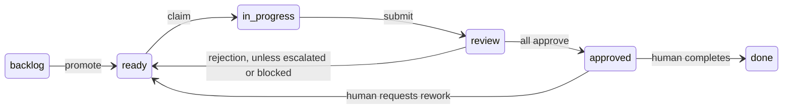

# Odonian API Reference

## Overview

The Odonian API is a RESTful coordination substrate for managing a backlog of work claimed and executed by AI agents. All endpoints (except `/healthz`) require a bearer token authentication.

Task URL paths accept full UUIDs or unique prefixes of at least eight characters; see
[Task ID Conventions](#task-id-conventions). Project IDs, document IDs, and dependency references
still require full UUIDs (or intra-batch task keys where supported).
JSON field names are lowercase (`id`, `project_id`, etc.).
The shared token authorizes access across every project and task; agent IDs identify actors
and lease owners, not separate authenticated principals.

## Authentication

All endpoints except `GET /healthz` require the `Authorization: Bearer <token>` header.

**Server Configuration:**
- `ODONIAN_TOKEN` (required): The bearer token to authenticate requests
- `ODONIAN_DB` (optional, default `odonian.db`): SQLite database path (e.g., `/data/odonian.db`)
- `ODONIAN_ADDR` (optional, default `:8080`): Server address and port

**Example:**
```bash
curl -H "Authorization: Bearer your-secret-token" https://api.example.com/projects
```

**Error Responses:**
- `401 MISSING_AUTH`: Authorization header is missing
- `401 INVALID_AUTH_FORMAT`: Authorization header is not in the format `Bearer <token>`
- `401 INVALID_TOKEN`: The provided token does not match the server token

## Endpoints

### Health Check

#### `GET /healthz`

Check server health (no authentication required).

**Request:**
```bash
curl http://localhost:8080/healthz
```

**Response (200 OK):**
```json
{
  "status": "ok"
}
```

---

### Projects

#### `POST /projects`

Create a new project.

**Request:**
```json
{
  "name": "My Project",
  "repo": "https://github.com/user/my-project"
}
```

**Response (201 Created):**
```json
{
  "id": "550e8400-e29b-41d4-a716-446655440000",
  "name": "My Project",
  "repo": "https://github.com/user/my-project",
  "created_at": "2026-06-05T21:00:00.000000000Z",
  "archived_at": null
}
```

**Status Codes:**
- `201 Created`: Project successfully created
- `400 EMPTY_NAME`: Project name cannot be empty
- `400 JSON_DECODE_ERROR`: Invalid JSON in request body
- `500 CREATE_ERROR`: Server error creating project

**Note:** The `id` field is a UUID that must be used in subsequent requests to reference this project.

---

#### `GET /projects/{id}`

Retrieve a project by ID, including an archived project.

**Request:**
```bash
curl -H "Authorization: Bearer token" \
  https://api.example.com/projects/550e8400-e29b-41d4-a716-446655440000
```

**Response (200 OK):**
```json
{
  "id": "550e8400-e29b-41d4-a716-446655440000",
  "name": "My Project",
  "repo": "https://github.com/user/my-project",
  "created_at": "2026-06-05T21:00:00.000000000Z",
  "archived_at": null
}
```

**Status Codes:**
- `200 OK`: Project found
- `404 NOT_FOUND`: Project not found
- `500 GET_ERROR`: Server error retrieving project

**Note:** The `archived_at` field is `null` for active projects or contains the timestamp when the project was archived.

---

#### `GET /projects`

List projects, ordered by creation time. Archived projects are excluded by default.

```bash
curl -H "Authorization: Bearer token" \
  'https://api.example.com/projects?claimable=true&model=haiku&kind=implement'
```

**Query Parameters:**

- `claimable=true`: Include only projects with at least one claimable, unarchived task.
- `model`: Restrict matching work to this model when `claimable=true`.
- `kind`: Restrict matching work to `implement`, `review`, or `merge` when `claimable=true`.
- `include_archived=true`: Include archived projects in the listing.
- `include_superseded=true`: Accepted by the discovery filter; superseded tasks remain
  unclaimable, so they do not cause a project to appear in claimable discovery.

**Response:** `200 OK` with an array of project objects, or `[]` if none match. Returns
`400 INVALID_KIND` for an unsupported kind and `500 LIST_ERROR` on a storage failure.

Project objects include `archived_at`: `null` for active projects and the archive timestamp
for archived projects. Use `include_archived=true` to list both, then inspect this field to
identify projects to unarchive.

#### `POST /projects/{id}/archive`

Soft-archive a project by setting `archived_at`. No request body is required.

```bash
curl -X POST -H "Authorization: Bearer token" \
  https://api.example.com/projects/550e8400-e29b-41d4-a716-446655440000/archive
```

**Response:** `200 OK` with the project object and its `archived_at` timestamp;
`404 NOT_FOUND` if absent, or `500 ARCHIVE_ERROR` on failure.

Archiving hides the project from default project listings and fleet discovery. It does not
archive its tasks, cancel active workers, or prevent direct requests using known IDs. It is
not an access control or a substitute for stopping a fleet pinned to that project.

#### `POST /projects/{id}/unarchive`

Restore a project's visibility by clearing `archived_at`. No request body is required.

```bash
curl -X POST -H "Authorization: Bearer token" \
  https://api.example.com/projects/550e8400-e29b-41d4-a716-446655440000/unarchive
```

**Response:** `200 OK` with the project object and `archived_at: null`;
`404 NOT_FOUND` if absent, or `500 UNARCHIVE_ERROR` on failure. Tasks retain their existing states.

---

### Documents

#### `POST /projects/{id}/documents`

Register a design or feature specification document.

**Request:**
```json
{
  "kind": "design",
  "title": "DESIGN.md",
  "ref": "DESIGN.md",
  "commit": "abc123def456"
}
```

**Parameters:**
- `kind` (required): Either `"design"` or `"feature_spec"`
- `title` (required): Human-readable title of the document
- `ref` (required): Repository-relative path or URL to the document
- `commit` (optional): Specific commit hash if the document is pinned to a particular version

**Response (201 Created):**
```json
{
  "id": "660e8400-e29b-41d4-a716-446655440001",
  "project_id": "550e8400-e29b-41d4-a716-446655440000",
  "kind": "design",
  "title": "DESIGN.md",
  "ref": "DESIGN.md",
  "commit": null,
  "created_at": "2026-06-05T21:00:00.000000000Z",
  "updated_at": "2026-06-05T21:00:00.000000000Z"
}
```

**Status Codes:**
- `201 Created`: Document successfully registered
- `400 INVALID_KIND`: `kind` must be `"design"` or `"feature_spec"`
- `400 JSON_DECODE_ERROR`: Invalid JSON in request body
- `404 NOT_FOUND`: Project not found
- `409 CONFLICT`: A design document already exists for this project (only one design per project allowed)
- `500 CREATE_ERROR`: Server error creating document

**Note:** Each project may have at most one `design` document, but multiple `feature_spec` documents.

---

#### `GET /projects/{id}/documents`

List all documents for a project.

**Request:**
```bash
# List all documents
curl -H "Authorization: Bearer token" \
  https://api.example.com/projects/550e8400-e29b-41d4-a716-446655440000/documents

# Filter by kind
curl -H "Authorization: Bearer token" \
  "https://api.example.com/projects/550e8400-e29b-41d4-a716-446655440000/documents?kind=design"
```

**Query Parameters:**
- `kind` (optional): Filter by `"design"` or `"feature_spec"`

**Response (200 OK):**
```json
[
  {
    "id": "660e8400-e29b-41d4-a716-446655440001",
    "project_id": "550e8400-e29b-41d4-a716-446655440000",
    "kind": "design",
    "title": "DESIGN.md",
    "ref": "DESIGN.md",
    "commit": null,
    "created_at": "2026-06-05T21:00:00.000000000Z",
    "updated_at": "2026-06-05T21:00:00.000000000Z"
  }
]
```

**Status Codes:**
- `200 OK`: Documents retrieved
- `500 LIST_ERROR`: Server error listing documents

---

### Research reviewer scorecards

#### `GET /projects/{id}/research/reviewers`

Read-only reviewer scorecards for a project's research-track tasks, per
docs/features/research-track.md §8. Findings are aggregated by reviewer model and severity across
every research `implement`/`design` task, spanning supersede chains without counting a finding
carried across a supersession twice. Build- and design-track review data is never included, and
adjudicator rulings are applied to the finding they rule on rather than counted as review rounds.
The endpoint does not rank reviewers or infer accuracy for unresolved findings.

**Request:**
```bash
curl -H "Authorization: Bearer token" \
  https://api.example.com/projects/550e8400-e29b-41d4-a716-446655440000/research/reviewers
```

**Response (200 OK):**
```json
{
  "reviewer_scorecards": [
    {
      "model": "opus",
      "findings_raised": {"p1": 1, "p2": 3, "p3": 2},
      "findings_held": 2,
      "findings_withdrawn": 1,
      "findings_unresolved": 3,
      "approvals_with_later_fixed_blocking_findings": 1,
      "total_review_rounds": 7,
      "sample_size": 4
    }
  ]
}
```

- `findings_raised`: distinct findings raised, by severity.
- `findings_held`: fixed by the worker, or upheld on adjudication.
- `findings_withdrawn`: withdrawn by the reviewer after a dispute, or overturned on adjudication.
- `findings_unresolved`: neither held nor withdrawn yet.
- `approvals_with_later_fixed_blocking_findings`: rounds this reviewer approved while another
  reviewer's blocking finding in the same chain was outstanding and later fixed (withdrawn or
  overturned findings never count).
- `total_review_rounds`: review rounds this reviewer submitted (approve or reject).
- `sample_size`: distinct tasks this reviewer reviewed.

Scorecards are sorted by model. An unknown project id, or a project with no research reviews,
returns `200` with an empty `reviewer_scorecards` array rather than `404`.

**Status Codes:**
- `200 OK`: Scorecards computed
- `401`: Missing or invalid bearer token (see [Authentication](#authentication))
- `500 GET_ERROR`: Server error computing scorecards

---

### Research Admission

#### `GET /research/policy`

Read the current research pacing policy (admission mode). Returns the configured pool mode
(`enforce`, `observe`, or `disabled`) and safe pool configuration without credentials.

**Request:**
```bash
curl -H "Authorization: Bearer token" \
  https://api.example.com/research/policy
```

**Response (200 OK):**
```json
{
  "mode": "enforce",
  "pools": [
    {
      "account_id": "account-1",
      "start_rate": 1.0,
      "burst_capacity": 10,
      "concurrent_limit": 5,
      "completion_reserved": 2
    }
  ]
}
```

**Status Codes:**
- `200 OK`: Policy retrieved
- `401`: Missing or invalid bearer token (see [Authentication](#authentication))
- `500 POLICY_ERROR`: Server error retrieving policy

---

#### `GET /research/status`

Read the current research pool status: configured limits, allowance tokens, active and deferred
task counts. Safe to expose publicly (no credentials, no task details).

**Request:**
```bash
curl -H "Authorization: Bearer token" \
  https://api.example.com/research/status
```

**Response (200 OK):**
```json
{
  "mode": "enforce",
  "pools": [
    {
      "account_id": "account-1",
      "active": 3,
      "active_completion": 1,
      "deferred": 2,
      "tokens": 7.5,
      "settled_at": "2026-10-03T12:00:00Z"
    }
  ]
}
```

Fields:
- `mode`: Current admission mode (`enforce`, `observe`, or `disabled`)
- `active`: Number of active research attempts
- `active_completion`: Number of active completion-class attempts
- `deferred`: Number of tasks still `ready` whose latest real (non-hypothetical, i.e. enforce-mode) admission was denied for
  either rate (`defer`) or concurrency/reserved capacity (`retry`). Observe-mode hypothetical denials are not counted, and a task
  leaves the count once it is claimed, cancelled or otherwise no longer `ready`
- `tokens`: Current token bucket level (capped at `burst_capacity`)
- `settled_at`: Timestamp when tokens were last settled

**Status Codes:**
- `200 OK`: Status retrieved
- `401`: Missing or invalid bearer token (see [Authentication](#authentication))
- `500 STATUS_ERROR`: Server error retrieving status

---

#### `POST /research/permits/{permit_id}/renew`

Extend the lease on an active research attempt. The attempt must be live (not finalized or
expired). Caller must provide the attempt's task, model, agent, and request identities; mismatches
are rejected with `409 PERMIT_IDENTITY_MISMATCH`.

**Request:**
```json
{
  "task_id": "task-uuid",
  "model": "haiku",
  "agent_id": "agent-uuid",
  "request_id": "request-uuid",
  "attempt_id": "attempt-uuid"
}
```

**Parameters:**
- `task_id` (required): ID of the task associated with this permit
- `model` (required): Model that claimed this permit
- `agent_id` (required): ID of the agent claiming this permit
- `request_id` (required): ID of the request associated with this permit
- `attempt_id` (required): ID of the current attempt to renew

**Response (200 OK):**
```json
{
  "attempt": {
    "id": "attempt-uuid",
    "permit_id": "permit-uuid",
    "task_id": "task-uuid",
    "expires_at": "2026-10-03T12:30:00Z",
    "state": "active"
  }
}
```

**Status Codes:**
- `200 OK`: Lease renewed
- `400 MISSING_TASK_ID`: task_id is required
- `400 MISSING_MODEL`: model is required
- `400 MISSING_AGENT_ID`: agent_id is required
- `400 MISSING_REQUEST_ID`: request_id is required
- `400 MISSING_ATTEMPT_ID`: attempt_id is required
- `401`: Missing or invalid bearer token (see [Authentication](#authentication))
- `404 PERMIT_NOT_FOUND`: Permit does not exist
- `409 PERMIT_IDENTITY_MISMATCH`: Provided task_id, model, agent_id, or request_id does not match the permit
- `409 ATTEMPT_FENCED`: Attempt ID does not match the permit's current attempt
- `409 ATTEMPT_EXPIRED`: Attempt lease has expired
- `409 ATTEMPT_FINALIZED`: Attempt is already finalized
- `500 RENEW_ERROR`: Server error renewing attempt

---

#### `POST /research/permits/{permit_id}/finalize`

End an active research attempt and record the outcome. The attempt must be live.
Caller must provide the attempt's task, model, agent, and request identities; mismatches
are rejected with `409 PERMIT_IDENTITY_MISMATCH`.

**Request:**
```json
{
  "task_id": "task-uuid",
  "model": "haiku",
  "agent_id": "agent-uuid",
  "request_id": "request-uuid",
  "attempt_id": "attempt-uuid",
  "exit_class": "completed",
  "usage_tokens": 1500
}
```

**Parameters:**
- `task_id` (required): ID of the task associated with this permit
- `model` (required): Model that claimed this permit
- `agent_id` (required): ID of the agent claiming this permit
- `request_id` (required): ID of the request associated with this permit
- `attempt_id` (required): ID of the current attempt to finalize
- `exit_class` (required): Outcome class: `completed`, `failed`, `cancelled`, or `unknown`
- `usage_tokens` (optional): Tokens consumed by this attempt; must be non-negative

**Response (200 OK):**
```json
{
  "attempt": {
    "id": "attempt-uuid",
    "permit_id": "permit-uuid",
    "task_id": "task-uuid",
    "state": "finalized",
    "exit_class": "completed"
  }
}
```

**Status Codes:**
- `200 OK`: Attempt finalized (idempotent: replaying finalize with the same parameters succeeds)
- `400 MISSING_TASK_ID`: task_id is required
- `400 MISSING_MODEL`: model is required
- `400 MISSING_AGENT_ID`: agent_id is required
- `400 MISSING_REQUEST_ID`: request_id is required
- `400 MISSING_ATTEMPT_ID`: attempt_id is required
- `400 MISSING_EXIT_CLASS`: exit_class is required
- `400 INVALID_EXIT_CLASS`: exit_class must be one of: completed, failed, cancelled, unknown
- `400 INVALID_USAGE_TOKENS`: usage_tokens must be non-negative
- `401`: Missing or invalid bearer token (see [Authentication](#authentication))
- `404 PERMIT_NOT_FOUND`: Permit does not exist
- `409 PERMIT_IDENTITY_MISMATCH`: Provided task_id, model, agent_id, or request_id does not match the permit
- `409 ATTEMPT_FENCED`: Attempt ID does not match the permit's current attempt
- `409 ATTEMPT_EXPIRED`: Attempt lease has expired
- `500 FINALIZE_ERROR`: Server error finalizing attempt

---

### Tasks

#### Task ID Conventions

Task ids are 36-character UUIDs, but table output (CLI, TUI) truncates them to
8 characters for readability. Every task-id route — `GET /tasks/{id}` and each
`/tasks/{id}/...` operation (claim, heartbeat, promote, submit, review,
transition, supersede, hold, release, archive, unarchive, events, and `PATCH
/tasks/{id}`) — accepts either the full id or any unique prefix of at least 8
characters, so a truncated id copied from a table can be used directly without
a `--json | jq` round trip to recover the full UUID:

- **Exact id** (36 characters): looked up as-is.
- **Unique prefix** (8-35 characters) matching exactly one task: resolved to
  that task.
- **No matching prefix**: `404 NOT_FOUND`.
- **Several matches**: `409 AMBIGUOUS_ID`, with the candidate ids listed in
  `error.candidates`.
- **Fewer than 8 characters**: always `404 NOT_FOUND` (too short to safely
  disambiguate).

The prefix is matched literally: `%` and `_` are not treated as SQL wildcards,
so a prefix such as `________` resolves to `404 NOT_FOUND` rather than matching
every task.

Resolution covers all tasks on the board, including archived and superseded tasks; it is not
scoped to the project currently displayed. Use a longer prefix or the full UUID on ambiguity.
IDs in response bodies remain full UUIDs. Prefix support applies to task IDs in URL paths,
not to project/document IDs or task IDs inside `depends_on` arrays.

**CLI local-worktree limitation:** `show` and `diff` can use a unique task prefix. In
`local_commit` mode, continue using full UUIDs for `wt-ensure`, implement-task `submit`,
`approve`, and `reject --abandon`: their filesystem operations still construct worktree and
`wip/<id>` names from the argument as typed. A prefix can resolve on the board but fail to find
the full-ID worktree or branch. The [demo](./demo.md#4-inspect-the-work-and-decide) uses full IDs.

#### `POST /projects/{id}/tasks`

Bulk-create tasks for a project.

**Request:**
```json
[
  {
    "key": "task1",
    "title": "Implement authentication",
    "spec": "Add bearer token authentication to all endpoints",
    "document_id": "660e8400-e29b-41d4-a716-446655440001",
    "model": "haiku",
    "review_models": ["opus", "sonnet"]
  },
  {
    "key": "task2",
    "title": "Add task claiming",
    "spec": "Implement atomic task claiming with leases",
    "document_id": "660e8400-e29b-41d4-a716-446655440001",
    "model": "haiku",
    "depends_on": ["task1"]
  }
]
```

**Parameters (per task):**
- `key` (optional): Client-provided unique key for referencing this task within the batch (for `depends_on`)
- `title` (required): Task title
- `spec` (required): Task specification/description
- `document_id` (required): ID of the design or feature document this task is decomposed from
- `model` (optional): Assigned model (e.g., `haiku`, `sonnet`, `opus`); must be in the deployment allowlist if provided. If omitted or empty, defaults to the deployment default model.
- `review_models` (optional): List of reviewer models for this task (e.g., `["opus", "sonnet"]`); each must be in the allowlist. Default is `["opus"]` if unset/empty. Ignored for review tasks (auto-spawned only).
- `depends_on` (optional): Array of task IDs or keys (if using intra-batch references) that must be done before this task is claimable
- `agent_merge` (optional, default `false`): Allow automatic completion after review; for work with a PR, spawn a non-LLM merge task.
- `escalate` (optional, default `true`): Allow replacement by a higher model tier after the review threshold is exceeded.
- `track` (optional, default `build`): `build`, `design`, or `research`; other values return `400 UNKNOWN_TRACK`. Omitted or empty values default to `build`. The track selects the harness prompt directory; supported delivery combinations are listed below.
- `branch` (optional, `local_commit` only): Name of an MR branch shared across tasks. Every task with the same `branch` starts its worktree from, and freezes onto, `wi/<branch>`, so a dependent task builds on earlier tasks' approved work without anything landing on `main`. Omitted or empty keeps the default: the task gets its own `wi/<slug of its title>`. Must be lowercase letters, digits, and single dashes (e.g. `event-platform`); otherwise `400 INVALID_BRANCH`. A task superseded or escalated to a new model keeps its branch. Each task still works on its own `wip/<id>` branch, so tasks sharing a branch can run concurrently: on approve, a task fast-forwards `wi/<branch>` when nothing else has landed on it since the task started, and is otherwise merged into it. A merge runs the repository's `make check` and `make test` on the merged result first, because the combination was never built or reviewed together. The gate runs the tasks' code, so it gets a scrubbed environment (no tokens or credentials) and refuses to run outside a sandbox (`SANDBOX_NAME` unset) unless `odonian approve --allow-host-gate` is passed; `--gate-timeout` (default 8m) bounds it. The scrubbed environment keeps the basics and the usual Go, Rust, Python, Node and Java toolchain variables; name any others the repository's `make` needs in `ODONIAN_GATE_ENV` (comma-separated). A merge conflict, a failing gate, or a gate that cannot run refuses the approve and leaves the task `approved` and the branch unchanged. After the gate, approve reserves the task for landing (`POST /tasks/{id}/landing`), conditional on it still being approved in the review round it prepared, so a task reworked and re-approved while the gate ran is never landed with its old version; it then moves `wi/<branch>`, and only then marks the task `done`, so dependents become claimable only once the work is on the branch they start from. It holds a per-branch lock in the repository (`refs/odonian/locks/<branch>`) throughout, so approves on one branch run one at a time. Use `depends_on` when a task needs another task's code to exist before it starts.

| Delivery mode | Supported tracks |
|---|---|
| `pull_request` | `build`, `design` |
| `local_commit` | `build` |

These combinations have worker and reviewer prompts in the bundled harness. The API validates
the track name, but delivery mode is a harness setting: `design` is accepted even when a slot
uses `local_commit`. If the selected prompt file is missing, the harness transitions the task
to `blocked` with a `no prompt for <delivery-mode>/<track>/<kind>: <path>` note, logs the missing
file, and sleeps 30 seconds before continuing. Once blocked, the task no longer prevents later
claimable work from being selected. Supply the missing prompt or use a compatible delivery
mode, then transition `blocked` → `ready` to retry. Supersession preserves the track, so merely
superseding the task will not resolve a missing prompt.

**Response (201 Created):**
```json
[
  {
    "id": "770e8400-e29b-41d4-a716-446655440002",
    "project_id": "550e8400-e29b-41d4-a716-446655440000",
    "document_id": "660e8400-e29b-41d4-a716-446655440001",
    "title": "Implement authentication",
    "spec": "Add bearer token authentication to all endpoints",
    "state": "backlog",
    "kind": "implement",
    "model": "haiku",
    "review_models": ["opus", "sonnet"],
    "review_round": 0,
    "assignee": null,
    "lease_expires_at": null,
    "result": null,
    "created_at": "2026-06-05T21:00:00.000000000Z",
    "updated_at": "2026-06-05T21:00:00.000000000Z"
  },
  {
    "id": "880e8400-e29b-41d4-a716-446655440003",
    "project_id": "550e8400-e29b-41d4-a716-446655440000",
    "document_id": "660e8400-e29b-41d4-a716-446655440001",
    "title": "Add task claiming",
    "spec": "Implement atomic task claiming with leases",
    "state": "backlog",
    "kind": "implement",
    "model": "haiku",
    "review_models": ["opus"],
    "review_round": 0,
    "assignee": null,
    "lease_expires_at": null,
    "result": null,
    "created_at": "2026-06-05T21:00:00.000000000Z",
    "updated_at": "2026-06-05T21:00:00.000000000Z"
  }
]
```

**Status Codes:**
- `201 Created`: Tasks successfully created
- `400 INVALID_DOCUMENT_ID`: One or more document IDs do not exist
- `400 UNKNOWN_MODEL`: The `model` or a `review_models` entry is not in the deployment allowlist
- `400 UNKNOWN_TRACK`: The `track` field is not one of `"build"`, `"design"`, or `"research"`
- `400 INVALID_BRANCH`: The `branch` field is not lowercase letters, digits, and single dashes
- `400 JSON_DECODE_ERROR`: Invalid JSON in request body
- `400 <other validation errors>`: Client input validation errors
- `500 CREATE_ERROR`: Server error creating tasks

**Note:** All tasks begin in the `backlog` state and must be promoted to `ready` before they can be claimed. All tasks default to `kind: implement` if not auto-spawned as review tasks.

---

#### `GET /projects/{id}/tasks`

List tasks for a project with optional filters.

**Request:**
```bash
# List all tasks
curl -H "Authorization: Bearer token" \
  https://api.example.com/projects/550e8400-e29b-41d4-a716-446655440000/tasks

# Filter by state
curl -H "Authorization: Bearer token" \
  "https://api.example.com/projects/550e8400-e29b-41d4-a716-446655440000/tasks?state=in_progress"

# Filter by model
curl -H "Authorization: Bearer token" \
  "https://api.example.com/projects/550e8400-e29b-41d4-a716-446655440000/tasks?model=haiku"

# Filter by kind
curl -H "Authorization: Bearer token" \
  "https://api.example.com/projects/550e8400-e29b-41d4-a716-446655440000/tasks?kind=implement"

# Filter by assignee
curl -H "Authorization: Bearer token" \
  "https://api.example.com/projects/550e8400-e29b-41d4-a716-446655440000/tasks?assignee=agent-1"

# Filter by claimable and model (worker polls for its own work)
curl -H "Authorization: Bearer token" \
  "https://api.example.com/projects/550e8400-e29b-41d4-a716-446655440000/tasks?claimable=true&model=haiku"

# Return summary view (omit spec and result)
curl -H "Authorization: Bearer token" \
  "https://api.example.com/projects/550e8400-e29b-41d4-a716-446655440000/tasks?fields=summary"
```

**Query Parameters:**
- `state` (optional): Filter by task state (`backlog`, `ready`, `in_progress`, `review`, `approved`, `done`, `blocked`, `failed`, `superseded`, `abandoned`)
- `model` (optional): Filter by assigned model (e.g., `haiku`, `sonnet`, `opus`)
- `kind` (optional): Filter by task kind (`implement`, `review`, or `merge`)
- `assignee` (optional): Filter by agent ID
- `claimable` (optional): If `true`, only return tasks in `ready`, or `in_progress` with an expired lease, that are not held and have all dependencies done.
- `include_archived` (optional): If `true`, include archived tasks; otherwise they are hidden.
- `include_superseded` (optional): If `true`, include superseded tasks; otherwise they are hidden even when filtering by `state=superseded`.
- `fields` (optional): `summary` omits `spec` and `result` while retaining the other task fields. Omitted or unrecognized values return the full listing representation. Fetch `GET /tasks/{id}` for the full task with dependencies and links.

**Response (200 OK):**

Without `fields=summary`:
```json
[
  {
    "id": "770e8400-e29b-41d4-a716-446655440002",
    "project_id": "550e8400-e29b-41d4-a716-446655440000",
    "document_id": "660e8400-e29b-41d4-a716-446655440001",
    "title": "Implement authentication",
    "spec": "Add bearer token authentication to all endpoints",
    "state": "ready",
    "kind": "implement",
    "model": "haiku",
    "review_models": ["opus"],
    "review_round": 0,
    "assignee": null,
    "lease_expires_at": null,
    "result": null,
    "created_at": "2026-06-05T21:00:00.000000000Z",
    "updated_at": "2026-06-05T21:00:00.000000000Z"
  }
]
```

With `fields=summary` (omits `spec` and `result`):
```json
[
  {
    "id": "770e8400-e29b-41d4-a716-446655440002",
    "project_id": "550e8400-e29b-41d4-a716-446655440000",
    "document_id": "660e8400-e29b-41d4-a716-446655440001",
    "title": "Implement authentication",
    "state": "ready",
    "kind": "implement",
    "model": "haiku",
    "review_models": ["opus"],
    "review_round": 0,
    "assignee": null,
    "lease_expires_at": null,
    "created_at": "2026-06-05T21:00:00.000000000Z",
    "updated_at": "2026-06-05T21:00:00.000000000Z"
  }
]
```

**Status Codes:**
- `200 OK`: Tasks retrieved
- `500 LIST_ERROR`: Server error listing tasks

**Note:** Response contains an empty array if no tasks match the filters. Claims require `ready`
or an expired `in_progress` lease, `held=false`, and every dependency in `done`. All tasks have a
`kind` and a `model`; review and merge tasks have a `target_task_id` pointing to their parent.

---

#### `GET /tasks/{id}`

Retrieve a task with its dependencies and links.

**Request:**
```bash
curl -H "Authorization: Bearer token" \
  https://api.example.com/tasks/770e8400-e29b-41d4-a716-446655440002
```

**Response (200 OK):**
```json
{
  "id": "770e8400-e29b-41d4-a716-446655440002",
  "project_id": "550e8400-e29b-41d4-a716-446655440000",
  "document_id": "660e8400-e29b-41d4-a716-446655440001",
  "title": "Implement authentication",
  "spec": "Add bearer token authentication to all endpoints",
  "state": "done",
  "kind": "implement",
  "model": "haiku",
  "review_models": ["opus"],
  "review_round": 1,
  "target_task_id": null,
  "assignee": "agent-1",
  "lease_expires_at": null,
  "result": "Completed successfully",
  "created_at": "2026-06-05T21:00:00.000000000Z",
  "updated_at": "2026-06-05T21:05:00.000000000Z",
  "depends_on": [
    "770e8400-e29b-41d4-a716-446655440000"
  ],
  "links": [
    {
      "id": "990e8400-e29b-41d4-a716-446655440004",
      "task_id": "770e8400-e29b-41d4-a716-446655440002",
      "kind": "pr",
      "value": "#123",
      "tombstoned_at": null,
      "review_round": 1
    },
    {
      "id": "aa0e8400-e29b-41d4-a716-446655440005",
      "task_id": "770e8400-e29b-41d4-a716-446655440002",
      "kind": "commit",
      "value": "abc123def456",
      "tombstoned_at": null,
      "review_round": 1
    }
  ]
}
```

Each link carries `review_round`: the review round of the implement submission that added it
(a link re-submitted unchanged moves to the new round), or `null` for links recorded before
links carried their round and for links on other kinds of task. Earlier rounds' links stay on the
task, so the submission under review is the links whose `review_round` equals the task's
`review_round`; for a task none of whose links have a round, it is all of them. The server reports
that set, minus tombstoned links, as `current_round_links`; clients use it rather than re-deriving
it. The no-op finalization (an approved round goes straight to `done`) requires the current
round's links to include a `no_op` and the task to have no active `pr` link; the PR is task-wide,
since a rework pushes to the same PR and may not re-submit its link. `POST /tasks/{id}/landing`
and the `LANDING_REQUIRED` check look only at the current round's links.

**Status Codes:**
- `200 OK`: Task retrieved
- `404 NOT_FOUND`: Task not found (including an id prefix with no matches, or shorter than 8 characters)
- `409 AMBIGUOUS_ID`: The id prefix matches more than one task; `error.candidates` lists the matching ids
- `500 GET_ERROR`: Server error retrieving task

**Note:** This endpoint returns lowercase field names, the full dependency list, and linked
resources. `{id}` accepts a unique prefix — see [Task ID Conventions](#task-id-conventions).

---

#### `POST /tasks/{id}/promote`

Promote a task from `backlog` to `ready` state.

**Request:**
```bash
curl -X POST -H "Authorization: Bearer token" \
  https://api.example.com/tasks/770e8400-e29b-41d4-a716-446655440002/promote
```

**Response (200 OK):**
```json
{
  "id": "770e8400-e29b-41d4-a716-446655440002",
  "project_id": "550e8400-e29b-41d4-a716-446655440000",
  "document_id": "660e8400-e29b-41d4-a716-446655440001",
  "title": "Implement authentication",
  "spec": "Add bearer token authentication to all endpoints",
  "state": "ready",
  "kind": "implement",
  "model": "haiku",
  "review_models": ["opus"],
  "review_round": 0,
  "assignee": null,
  "lease_expires_at": null,
  "result": null,
  "created_at": "2026-06-05T21:00:00.000000000Z",
  "updated_at": "2026-06-05T21:00:30.000000000Z"
}
```

**Status Codes:**
- `200 OK`: Task promoted successfully
- `404 NOT_FOUND`: Task not found
- `409 CONFLICT`: Task is not in backlog state
- `500 PROMOTE_ERROR`: Server error promoting task

**Note:** Promotion is the human's gate — only promoted tasks can be claimed by agents.

---

#### `POST /tasks/{id}/claim`

Claim a task and move it to `in_progress` state with a lease.

**Request:**
```json
{
  "agent_id": "agent-1",
  "model": "haiku"
}
```

**Parameters:**
- `agent_id` (required): The ID of the agent claiming the task (non-empty string)
- `model` (required): The model assigned to the claiming agent (e.g., `haiku`, `sonnet`, `opus`); must match the task's model

**Response (200 OK):**
```json
{
  "id": "770e8400-e29b-41d4-a716-446655440002",
  "project_id": "550e8400-e29b-41d4-a716-446655440000",
  "document_id": "660e8400-e29b-41d4-a716-446655440001",
  "title": "Implement authentication",
  "spec": "Add bearer token authentication to all endpoints",
  "state": "in_progress",
  "kind": "implement",
  "model": "haiku",
  "review_models": ["opus"],
  "review_round": 0,
  "assignee": "agent-1",
  "lease_expires_at": "2026-06-05T21:05:00.000000000Z",
  "result": null,
  "created_at": "2026-06-05T21:00:00.000000000Z",
  "updated_at": "2026-06-05T21:01:00.000000000Z"
}
```

**Status Codes:**
- `200 OK`: Task claimed successfully
- `400 EMPTY_AGENT_ID`: agent_id cannot be empty
- `400 EMPTY_MODEL`: model cannot be empty
- `400 JSON_DECODE_ERROR`: Invalid JSON in request body
- `404 NOT_FOUND`: Task not found
- `409 CONFLICT`: Task is not claimable (not in ready state, has an active lease, or has undone dependencies)
- `409 MODEL_MISMATCH`: The task's model does not match the declared model
- `500 CLAIM_ERROR`: Server error claiming task

**Claimability Rules:**
A task is claimable only if:
1. It is in the `ready` state
2. No active lease exists (or the lease has expired)
3. All tasks in its `depends_on` set are in the `done` state
4. The task's `model` matches the agent's declared model (server enforced)

The claim is atomic — implemented as a conditional UPDATE statement. If the claim succeeds, `rowsAffected == 1` and the task is guaranteed to be in `in_progress` with a fresh lease. If `rowsAffected == 0`, the client lost the race (another agent claimed it first) or the model didn't match, and should retry with a different task.

**Research admission (research-track tasks only):**
Research claims are admitted against the research pacing policy in the same transaction as the claim, so a start is debited only when the claim succeeds. Legacy clients that send only `agent_id` and `model` are paced identically. Non-research claims and `disabled` mode return the bare task above.

Optional request fields: `request_id` (stable key; retrying the same request recovers the original admission, `replayed: true`), `account_id` and `work_class` (assertions only — the server derives both; a mismatch is `400 INVALID_RESEARCH_CLAIM`, an unknown class is `400 INVALID_WORK_CLASS`).

An admitted claim adds `research_admission` to the task body: `permit_id`, `attempt_id`, `request_id`, `account_id`, `expires_at`, `replayed`, and in `observe` mode `observed_denial` (the hypothetical outcome; the work is still granted). Pass `attempt_id` on heartbeat and submit; a superseded attempt gets `409 ATTEMPT_FENCED` (or `409 ATTEMPT_EXPIRED`) and cannot change its replacement. Heartbeats never spend a start. The `odonian` CLI does this automatically: `claim` saves the attempt ID in a file keyed by task and worker session (`$ODONIAN_SESSION_ID`, else `$CLAUDE_CODE_SESSION_ID`, else `$CODEX_SESSION_ID`) under `$ODONIAN_STATE_DIR` (default the user cache dir), so a replacement session never overwrites the ID a stale session reads; with no session variable set the file is per-task and cannot distinguish sessions. `heartbeat`/`submit` send it back (override with `--attempt`). A heartbeat or submit with no `attempt_id` is a legacy call that cannot be told apart from a replacement of the same agent. Rework, adjudication, reclaim and retry each count as a start.

A denial is `429 ADMISSION_DENIED` with `error.outcome` (`defer` or `retry`), `error.reason` (`rate`, `concurrency` or `reserved_capacity`), `error.not_before` and/or `error.retry_after_seconds` (also sent as `Retry-After`). The task is left untouched — not blocked, failed or rejected — and may be claimed again later. Other research errors: `409 TASK_BUSY` (a live research attempt still holds the task), `409 REQUEST_ID_CONFLICT` (`request_id` reused for a different task, agent, model or pool).

A submit ends task ownership but not the dispatch: the research attempt stays active, so it keeps holding its concurrency slot and a rework claim of that task is `409 TASK_BUSY` in `enforce` mode until the attempt lapses at its lease expiry. After submission, renewing and finalizing a research attempt is exposed via `POST /research/permits/{permit_id}/renew` and `POST /research/permits/{permit_id}/finalize` (see the dedicated sections below). In `observe` mode a live attempt on the task is recorded as a hypothetical busy refusal (`outcome: retry`, `reason: concurrency`) and superseded, and the claim is granted.

---

#### `POST /tasks/{id}/heartbeat`

Extend the lease on a task claimed by an agent.

**Request:**
```json
{
  "agent_id": "agent-1"
}
```

**Parameters:**
- `agent_id` (required): The ID of the agent (must match the task's assignee)

**Response (200 OK):**
```json
{
  "id": "770e8400-e29b-41d4-a716-446655440002",
  "project_id": "550e8400-e29b-41d4-a716-446655440000",
  "document_id": "660e8400-e29b-41d4-a716-446655440001",
  "title": "Implement authentication",
  "spec": "Add bearer token authentication to all endpoints",
  "state": "in_progress",
  "kind": "implement",
  "model": "haiku",
  "review_models": ["opus"],
  "review_round": 0,
  "assignee": "agent-1",
  "lease_expires_at": "2026-06-05T21:10:00.000000000Z",
  "result": null,
  "created_at": "2026-06-05T21:00:00.000000000Z",
  "updated_at": "2026-06-05T21:02:00.000000000Z"
}
```

**Status Codes:**
- `200 OK`: Heartbeat successful, lease extended
- `400 EMPTY_AGENT_ID`: agent_id cannot be empty
- `400 JSON_DECODE_ERROR`: Invalid JSON in request body
- `404 NOT_FOUND`: Task not found
- `409 CONFLICT`: Task is not in_progress or is not assigned to the provided agent_id
- `500 HEARTBEAT_ERROR`: Server error extending lease

**Note:** Agents should call this regularly (at least before the lease expires) to prevent the task from becoming claimable by another agent. The lease duration is configured on the server side.

---

#### `POST /tasks/{id}/submit`

Submit a task for review (implement tasks) or submit a verdict (review tasks). Behavior depends on task kind.

**For `kind: implement` tasks** — Submit for review with work links:

**Request:**
```json
{
  "agent_id": "agent-1",
  "result": "Task completed successfully. Implemented bearer token auth on all endpoints.",
  "links": [
    {
      "kind": "pr",
      "value": "#123"
    },
    {
      "kind": "commit",
      "value": "abc123def456"
    }
  ]
}
```

**Parameters:**
- `agent_id` (required): The ID of the agent submitting (must match the task's assignee)
- `result` (required): Summary of work completed
- `links` (optional): Array of external resource references
- `verdict` (forbidden): Must not be present for implement tasks
- `disputes` (optional, research-track rework only): Array of finding disputes, per
  docs/features/research-track.md §5. Only accepted on an `implement`-kind, `research`-track task
  that has at least one prior review round (a rework submission, not the first submission).
  Omitting the field, or sending an explicit `null`, behaves exactly as before on every other
  submission. Each dispute:
  - `finding_id` (required): Non-empty string naming a finding from the round being reworked,
    unique within the submission (no disputing the same id twice in one payload). It must have
    been raised by exactly one reviewer in that round — an id two reviewers both used is
    ambiguous and rejected.
  - `evidence` (required): Non-empty string citing the source evidence the dispute relies on.
- `manifest` (optional, research-track implement only): A research continuation manifest, per
  docs/features/research-continuations.md. Only accepted on an `implement`-kind, `research`-track
  task whose spec opts in with a `## continuation manifest` heading line. Its `parent_task_id`
  must be the submitted task. Omitting the field, or sending an explicit `null`, behaves exactly
  as before. The server canonicalises the manifest and stores it, with its SHA-256 digest, for the
  review round the submission starts; every round's manifest is returned by `GET /tasks/{id}` as
  `submission_manifests` (`review_round`, `parent_task_id`, `manifest_json`, `manifest_digest`,
  `submitted_at`; `[]` when none). A rework round adds a new entry and leaves earlier rounds'
  entries untouched. The CLI sends it with `odonian submit --manifest-file <path>`.

  `GET /tasks/{id}` also returns a read-only `continuation` object (omitted when empty), shown
  by `odonian show` under "Research Continuation": `manifest_digest` of the current round's
  manifest; `proposed_children` (`key`, `title`, `track`, `model`, `initial_state` — `ready` for
  research, `backlog` otherwise —, `dependencies`, and `status`: `pending` before the parent's
  verified merge, `created` with `created_task_id` after it, `not_created` if the parent finished
  without creating it); `created_children` (`id`, `key`, `parent_task_id`, `manifest_digest`,
  current `state`, `track`, `dependency_status` of `none`/`satisfied`/`blocked`, `depends_on`,
  `blocked_by`, `claimable`, and the claim/source/file-scope/acceptance metadata);
  `deferred_claims` (carried-forward candidates and their `owner`) and `excluded_claims` (out of
  scope, with a `reason` and no owner), reported exactly as the manifest states them with no
  coverage inferred; `action_items` (`legacy_held_follow_up`, `held_dependent`) naming held legacy
  tasks or dependents that must be replaced or retargeted by hand, since the server never repoints
  them; and, on a created child, `parent_info` (`id`, `child_key`, `manifest_digest`). Tasks born
  from non-blocking review findings are not continuations: they are listed separately as
  `finding_follow_ups` (`id`, `title`, `state`, `track`, `held`).

  A dispute never alters the finding it names. It is recorded on the submission's own event and
  delivered, in the next round, to the review task of the reviewer who raised that finding — the
  raising reviewer re-evaluates the finding against the evidence and either withdraws it (reports
  it `resolved`) or maintains it (reports it `still_open`). The same finding cannot be disputed a
  second time, even if the raising reviewer carries it forward under a new id in a later round
  (`still_open` with `prior_id` linking back to it): this is checked by the finding's identity —
  the raising reviewer plus its `prior_id` chain — not by the bare `finding_id` string, since
  reviewers choose ids independently and two reviewers may reuse the same id for unrelated
  findings.

**Link Types:**
- `pr`: Pull request reference (e.g., `#123` or `owner/repo#123`)
- `commit`: Commit hash (e.g., `abc123def456`)
- `branch`: Branch name (e.g., `feature/auth`)
- `ci`: CI status/build URL (e.g., `https://ci.example.com/builds/123`)
- `no_op`: Review-verified no-op marker (e.g., `already-satisfied`). Used when the acceptance
  criteria are already satisfied on `main` with no diff: the worker submits with this marker and
  NO `pr` link, and the reviewer verifies the claim against `main` before approving.

**Response (200 OK):**
```json
{
  "id": "770e8400-e29b-41d4-a716-446655440002",
  "project_id": "550e8400-e29b-41d4-a716-446655440000",
  "document_id": "660e8400-e29b-41d4-a716-446655440001",
  "title": "Implement authentication",
  "spec": "Add bearer token authentication to all endpoints",
  "state": "review",
  "kind": "implement",
  "model": "haiku",
  "review_models": ["opus"],
  "review_round": 1,
  "assignee": "agent-1",
  "lease_expires_at": null,
  "result": "Task completed successfully. Implemented bearer token auth on all endpoints.",
  "created_at": "2026-06-05T21:00:00.000000000Z",
  "updated_at": "2026-06-05T21:03:00.000000000Z",
  "depends_on": [],
  "links": [
    {
      "id": "990e8400-e29b-41d4-a716-446655440004",
      "task_id": "770e8400-e29b-41d4-a716-446655440002",
      "kind": "pr",
      "value": "#123"
    },
    {
      "id": "aa0e8400-e29b-41d4-a716-446655440005",
      "task_id": "770e8400-e29b-41d4-a716-446655440002",
      "kind": "commit",
      "value": "abc123def456"
    }
  ]
}
```

---

**For `kind: review` tasks** — Submit a verdict:

**Request:**
```json
{
  "agent_id": "opus-reviewer-1",
  "verdict": "approve",
  "result": "Code review passed. Well-structured and thoroughly tested. One minor comment on error handling.",
  "findings": [
    {
      "id": "f1",
      "severity": "P2",
      "file": "internal/api/api.go",
      "line": 42,
      "summary": "Missing nil check before dereference.",
      "in_changed_text": true,
      "status": "new"
    }
  ]
}
```

**Parameters:**
- `agent_id` (required): The ID of the reviewing agent (must match the task's assignee)
- `verdict` (required): Either `"approve"` or `"reject"`
- `result` (optional): Review writeup or detailed feedback
- `findings` (optional on build/design review tasks; required on research-track review tasks):
  Array of structured findings, only accepted on review-kind tasks. On build/design review tasks,
  omitting the field, or sending an explicit `null`, behaves exactly as before. On a research-track
  review task, the field must be present and must be an array (send `[]` when there are no
  findings); omitting it or sending `null` returns `400 MISSING_FINDINGS`. Each finding:
  - `id` (required): Non-empty string, unique within the submission.
  - `severity` (required): One of `P1`, `P2`, `P3`.
  - `file` (required): Non-empty string.
  - `line` (required): A positive integer.
  - `summary` (required): Non-empty string.
  - `in_changed_text` (required): Boolean.
  - `status` (required): One of `new`, `still_open`, `resolved`.
  - `prior_id`: The id of an earlier finding. Required when `status` is `still_open` or
    `resolved`, and must be absent (not even `null`) when `status` is `new`.

  Findings are stored on the review event and returned by `GET /tasks/{id}/events`.

**Response (200 OK):**
```json
{
  "id": "aa0e8400-e29b-41d4-a716-446655440006",
  "project_id": "550e8400-e29b-41d4-a716-446655440000",
  "document_id": "660e8400-e29b-41d4-a716-446655440001",
  "title": "Review: Implement authentication [opus]",
  "spec": "...",
  "state": "done",
  "kind": "review",
  "model": "opus",
  "review_models": null,
  "review_round": 1,
  "target_task_id": "770e8400-e29b-41d4-a716-446655440002",
  "assignee": "opus-reviewer-1",
  "lease_expires_at": null,
  "result": "Code review passed. Well-structured and thoroughly tested. One minor comment on error handling.",
  "created_at": "2026-06-05T21:03:00.000000000Z",
  "updated_at": "2026-06-05T21:04:30.000000000Z"
}
```

The response includes the review task's own `id` and the parent implement task's `id` in `target_task_id`. If this verdict completes the current review round (all reviewers have verdicted), the parent task will also be automatically transitioned:
- All approve → parent moves to `approved`
- Any reject → parent moves to `ready` for rework

Research-track parents aggregate on findings, not just verdicts: a `reject` verdict with `[]`
findings can still pass the round, and an `approve` verdict carrying a blocking finding still fails
it. See docs/features/research-track.md §3 for the full blocking rules.

---

**Status Codes (both kinds):**
- `200 OK`: Submit successful
- `400 EMPTY_AGENT_ID`: agent_id cannot be empty
- `400 INVALID_LINK_KIND`: One or more link kinds are invalid (must be pr, branch, commit, ci, or no_op)
- `400 INVALID_VERDICT`: verdict must be "approve" or "reject" (review only)
- `400 FORBIDDEN_VERDICT`: verdict must not be present for implement tasks
- `400 MISSING_VERDICT`: verdict is required for review tasks
- `400 INVALID_FINDINGS`: A findings array is malformed; the message names the first invalid field
- `400 MISSING_FINDINGS`: findings were omitted (or `null`) on a research-track review task
- `400 FINDINGS_NOT_ALLOWED`: findings were provided on a non-review-kind task
- `400 INVALID_DISPUTES`: A disputes array is malformed (not an array, a non-empty-string
  `finding_id`/`evidence` missing, or a `finding_id` repeated in the same submission)
- `400 DISPUTES_NOT_ALLOWED`: disputes were provided on a task that is not a research-track
  implement rework submission
- `400 MANIFEST_NOT_ALLOWED`: a manifest was provided on a task that is not a research-track
  implement submission
- `400 PARENT_NOT_OPTED_IN`: a manifest was provided but the task spec has no
  `## continuation manifest` heading line
- `400 MISMATCHED_PARENT_TASK`: the manifest's `parent_task_id` is not the submitted task
- `400 INVALID_MANIFEST_JSON`: the manifest is not a JSON object matching the manifest schema
  (unknown fields and trailing data are rejected)
- `400` with a manifest validator code (for example `UNKNOWN_MODEL`, `UNKNOWN_TRACK`,
  `TOO_MANY_CHILDREN`): the manifest is outside the child envelope
- `400 NO_PRIOR_ROUND`: disputes were provided on a research-track task's first implement
  submission, which has no prior review round to dispute a finding from
- `400 UNKNOWN_FINDING_ID`: a disputed `finding_id` was not raised by any reviewer in the round
  being reworked
- `400 AMBIGUOUS_FINDING_ID`: a disputed `finding_id` was raised by more than one reviewer in the
  round being reworked, so it cannot be resolved to a single reviewer
- `400 DUPLICATE_DISPUTE`: a disputed `finding_id` was already disputed on an earlier rework round
- `400 JSON_DECODE_ERROR`: Invalid JSON in request body
- `404 NOT_FOUND`: Task not found
- `409 CONFLICT`: Task is not in_progress or is not assigned to the provided agent_id
- `500 SUBMIT_ERROR`: Server error submitting task

**Note:** Links are indexed on `(kind, value)` to enable reverse lookup. Review verdicts, including
any findings, are recorded as events on the parent implement task for audit purposes.

---

#### `POST /tasks/{id}/review`

Post a review verdict on a task in the `review` state.

**Request:**
```json
{
  "actor": "reviewer@example.com",
  "verdict": "approve",
  "note": "Looks good! Code quality is solid."
}
```

**Parameters:**
- `actor` (required): Human-readable identifier of the reviewer (non-empty string)
- `verdict` (required): Either `"approve"` or `"reject"`
- `note` (optional): Free-form note or feedback

**Response (201 Created):**
```json
{
  "id": "bb0e8400-e29b-41d4-a716-446655440006",
  "task_id": "770e8400-e29b-41d4-a716-446655440002",
  "actor": "reviewer@example.com",
  "kind": "review",
  "verdict": "approve",
  "note": "Looks good! Code quality is solid.",
  "created_at": "2026-06-05T21:04:00.000000000Z"
}
```

**Status Codes:**
- `201 Created`: Review event recorded
- `400 EMPTY_ACTOR`: actor cannot be empty
- `400 INVALID_VERDICT`: verdict must be "approve" or "reject"
- `400 JSON_DECODE_ERROR`: Invalid JSON in request body
- `404 NOT_FOUND`: Task not found
- `409 CONFLICT`: Task is not in review state
- `500 REVIEW_ERROR`: Server error recording review

**Note:** Review events are immutable and append-only. They do not directly transition the task state — that is done via a separate `POST /tasks/{id}/transition` call. If verdict is `reject`, the task typically transitions back to `ready` for rework.

---

#### `POST /tasks/{id}/transition`

Transition a task to a new state (manual state machine operation). Typically used by humans
to drain the `approved` lane by merging and marking done, or to override an approval.

**Request:**
```json
{
  "to": "done",
  "note": "Reviewed and merged to main"
}
```

**Parameters:**
- `to` (required): Target state (`done`, `blocked`, `ready`, `failed`, `superseded`, or `abandoned`)
- `note` (optional): Reason or context for the transition

**Response (200 OK):**
```json
{
  "id": "770e8400-e29b-41d4-a716-446655440002",
  "project_id": "550e8400-e29b-41d4-a716-446655440000",
  "document_id": "660e8400-e29b-41d4-a716-446655440001",
  "title": "Implement authentication",
  "spec": "Add bearer token authentication to all endpoints",
  "state": "done",
  "kind": "implement",
  "model": "haiku",
  "review_models": ["opus"],
  "review_round": 1,
  "assignee": "agent-1",
  "lease_expires_at": null,
  "result": "Task completed successfully. Implemented bearer token auth on all endpoints.",
  "created_at": "2026-06-05T21:00:00.000000000Z",
  "updated_at": "2026-06-05T21:05:00.000000000Z"
}
```

**Status Codes:**
- `200 OK`: Task transitioned successfully
- `400 INVALID_STATE`: Target state is invalid
- `400 JSON_DECODE_ERROR`: Invalid JSON in request body
- `404 NOT_FOUND`: Task not found
- `409 CONFLICT`: Transition is not allowed from the current state
- `409 LANDING_IN_PROGRESS`: The task is `approved` and reserved by an `odonian approve` landing its work (see `POST /tasks/{id}/landing`); only that approve can move it, to `done` via `POST /tasks/{id}/landing/complete`, until it finishes or the reservation is cancelled
- `409 LANDING_REQUIRED`: `to: done` for an `approved` task whose current review round submitted a `commit` (a `local_commit` task): its work must land on its branch first, so it reaches `done` only through `odonian approve` (`POST /tasks/{id}/landing` then `/landing/complete`)
- `500 TRANSITION_ERROR`: Server error transitioning task. For an opted-in research parent moving `approved` → `done`, this includes a stored continuation manifest that fails re-validation or whose digest no longer matches; the transition is rolled back, the parent stays `approved`, and no children are created

`approved` → `done` is also the moment the server creates the children of a reviewed continuation manifest (see the `manifest` field of `POST /tasks/{id}/submit`); no other transition creates them. A repeated `done` is a `409 CONFLICT` and creates nothing.

**Valid Transitions:**
The state machine enforces these rules:
- `ready` → `in_progress` (via claim)
- `in_progress` → `review` (via submit for implement tasks)
- `review` → `approved` (when all reviewers approve; via the final verdict, or release after a held round finishes)
- `review` → `done` (automatic after unanimous approval when `agent_merge=true`, a `no_op` link exists, and no `pr` link exists)
- `review` → `ready` (once every review finishes and at least one rejects, unless the circuit breaker escalates or blocks the task)
- `approved` → `done` (human merges PR; for a `local_commit` task, only via `POST /tasks/{id}/landing/complete` — see `LANDING_REQUIRED`)
- `approved` → `ready` (human disagrees with reviewers, requests rework)
- `blocked` → `ready` (human unblocks / retries; clears stale assignee and lease)
- `blocked` → `failed` (retire a dead blocked task without re-entering the queue)
- Any active state → `blocked` (off-ramp: external blocker)
- Any active state → `failed` (off-ramp: task cannot be done as specified)
- Any active state → `superseded` (retire without creating a replacement; use `/supersede` to create one)
- `approved` → `abandoned` (retire without merging)
- `in_progress` → `done` for `merge` tasks only

The operator `/transition` endpoint does not permit `review` → `done`. Review aggregation does
perform that direct transition for the opted-in no-op case above, in a single update; the parent
never enters `approved` and will not appear in a script that drains that lane. A no-op task with
`agent_merge=false` still waits in `approved` for a human decision. Merge subtasks instead go
from `in_progress` to `done` after merging.

`blocked` is recoverable via `blocked` → `ready`; use `blocked` → `failed` to retire it.
The `/transition` endpoint cannot move a task out of `done`, `failed`, `superseded`, or `abandoned`.
The separate `/supersede` endpoint also rejects these terminal states with `409 CONFLICT`.

---

### Task events and operator actions

#### `GET /tasks/{id}/events`

Return the task's retained audit events, oldest first, ordered by `created_at` and then `id`.

```bash
curl -H "Authorization: Bearer token" \
  https://api.example.com/tasks/770e8400-e29b-41d4-a716-446655440002/events
```

**Response (200 OK):**

```json
[
  {
    "id": "990e8400-e29b-41d4-a716-446655440004",
    "task_id": "770e8400-e29b-41d4-a716-446655440002",
    "actor": "haiku-1",
    "kind": "claim",
    "verdict": null,
    "note": null,
    "findings": null,
    "source_task_id": null,
    "created_at": "2026-06-05T21:00:00.000000000Z"
  }
]
```

`findings` is non-null only on `review` events for which the reviewer submitted structured
findings (see `POST /tasks/{id}/submit` above); it is `null` on every other event.

`source_task_id` is non-null only on a `review` event that a review task appended to its parent; it
holds the id of that review task. It is `null` on events from other sources, such as `POST
/tasks/{id}/review`.

Returns `[]` when there are no retained events, including for an unknown full-length task UUID.
An unmatched or too-short prefix returns `404 NOT_FOUND`; an ambiguous prefix returns
`409 AMBIGUOUS_ID`. Use `GET /tasks/{id}` to check existence when passing a full UUID.
Storage failures return `500 GET_ERROR`.
See [event retention configuration](./configuration.md#server-odonian-server).

#### `PATCH /tasks/{id}`

Replace the task's complete dependency list. This endpoint currently updates only dependencies;
it does not edit the title, spec, model, or other task fields.

```bash
curl -X PATCH -H "Authorization: Bearer token" -H 'Content-Type: application/json' \
  https://api.example.com/tasks/770e8400-e29b-41d4-a716-446655440002 \
  -d '{"depends_on":["880e8400-e29b-41d4-a716-446655440003"]}'
```

Use full existing task UUIDs inside `depends_on`; the URL's task ID can be a unique prefix.
`{"depends_on":[]}` clears dependencies; omitting `depends_on`
or setting it to `null` also clears the list. Unknown JSON fields are ignored, so sending only
an unsupported field would clear dependencies too. Send an explicit `depends_on` array.

**Response:** `200 OK` with the task object. Fetch `GET /tasks/{id}` to read back `depends_on`;
the PATCH response does not include the dependency list. Errors include `400 SELF_DEPENDENCY`,
`400 JSON_DECODE_ERROR`, `409 CYCLE_DETECTED`, and `404 NOT_FOUND` for a missing task with an
empty replacement list. Invalid dependency IDs, duplicates, or other storage failures currently
return `500 UPDATE_ERROR`.

#### `PATCH /tasks/{id}/escalation`

Update the task's automatic escalation policy. This endpoint controls whether the task **may** be
escalated to a higher-capacity model if needed, independent of the task's initial model assignment.

**Model assignment and escalation are separate concerns:**
- **Initial model**: The model chosen when the task is created (e.g., Haiku, Sonnet). This sizing
  decision is based on task complexity and is immutable.
- **Escalation permission** (the `escalate` field): A boolean policy flag controlling whether the
  task may be automatically promoted to a higher-capacity model if the assigned model runs out of
  capacity or if review feedback indicates that additional capability is needed. Enabled by default.
- **Task resumption/escalation** (a separate action): The act of actually promoting a task to a
  higher model occurs exclusively through the automated circuit breaker: when a rejected task's
  review round exceeds the threshold and `escalate` is true, the task is superseded onto the next
  model tier. There is no manual endpoint to escalate a task's model tier; `/tasks/{id}/promote`
  is unrelated — it moves a task from `backlog` to `ready` and does not change its model.
  Changing the `escalate` setting here does NOT immediately resume or escalate a task.

```bash
curl -X PATCH -H "Authorization: Bearer token" -H 'Content-Type: application/json' \
  https://api.example.com/tasks/770e8400-e29b-41d4-a716-446655440002/escalation \
  -d '{"escalate":true}'
```

The request requires exactly one field, `escalate`, and it must be a boolean (`true` or `false`).
Missing, null, non-boolean, or unknown fields are rejected with `400 BAD_REQUEST`. Omitting the
field, setting it to `null`, or sending an unrecognized field all fail validation without
mutating the task.

**Response:** `200 OK` with the task object showing the new escalation policy. The field `escalate`
in the response indicates the current policy. Repeating the same value is idempotent. Errors
include `400 MISSING_FIELD`, `400 NULL_FIELD`, `400 INVALID_FIELD_TYPE`, `400 UNKNOWN_FIELD`,
`400 JSON_DECODE_ERROR`, `409 CONFLICT` for a task in a disallowed terminal state (e.g., `done`,
`failed`, `abandoned`), and `404 NOT_FOUND` for a missing task.

Changing the escalation policy does not change the task's initial model, current state, lease,
review round, dependencies, history, or PR links. A blocked task may still update its escalation
policy.

#### `POST /tasks/{id}/supersede`

Create a replacement task and atomically repoint dependents to it. The old task becomes
`superseded` with `superseded_by` set to the new ID. The replacement starts in `backlog` with
review round zero, copies the title, spec, model, reviewer models, track, merge/escalation settings,
and upstream dependencies, and appends prior rejection feedback to the spec when present.

Supersession accepts `backlog`, `ready`, `in_progress`, `review`, `approved`, and `blocked` tasks.
It rejects `done`, `failed`, `abandoned`, and already `superseded` tasks with `409 CONFLICT`,
leaving their dependencies unchanged. Track is preserved for both manual supersession and
circuit-breaker escalation, so a design task's replacement still uses design prompts.

```bash
curl -X POST -H "Authorization: Bearer token" -H 'Content-Type: application/json' \
  https://api.example.com/tasks/770e8400-e29b-41d4-a716-446655440002/supersede \
  -d '{"model":"sonnet"}'
```

`model` is optional and must be in the server's allowlist. Send `{}` to keep the current model;
a JSON body is required. The replacement must be promoted separately. This operator endpoint
differs from circuit-breaker escalation, which automatically promotes its replacement.

**Response:** `201 Created` with the **new task**, including its full UUID. Returns
`400 UNKNOWN_MODEL`, `400 JSON_DECODE_ERROR`, `404 NOT_FOUND`, `409 CONFLICT` for a terminal
task, `409 LANDING_IN_PROGRESS` for an `approved` task an approve is landing, or
`500 SUPERSEDE_ERROR`.

After the board transaction commits, the server attempts to close the old task's open PR and
delete its head branch using its per-owner forge token. If the file or matching token is
missing or empty, cleanup is skipped without any GitHub requests and one log line identifies
the owner and PR. There is no `gh` or `GH_TOKEN` fallback. Cleanup runs asynchronously;
a successful response confirms the board change, not completion of GitHub
cleanup. PR-watch retries stale open PR cleanup on later passes only when it has a matching
owner token. Supersession does not stop a running agent process.

#### `POST /tasks/{id}/hold`

Set `held=true` without changing the task state or lease. No request body is required.

```bash
curl -X POST -H "Authorization: Bearer token" \
  https://api.example.com/tasks/770e8400-e29b-41d4-a716-446655440002/hold
```

Held tasks cannot be claimed, and reviewer submission skips automatic aggregation for a held
parent. Holding does not terminate an already running worker or revoke its lease; it is not a
general ban on API transitions or forge actions.

Reviewers may finish while their parent is held. The parent stays in `review` until released;
`/release` applies the completed round's verdicts in the same transaction as clearing the hold.

**Response:** `200 OK` with the task object and `held: true`; `404 NOT_FOUND` if absent,
or `500 HOLD_ERROR` on failure.

#### `POST /tasks/{id}/release`

Clear `held` and, for a parent in `review` whose current round is complete, apply the review
verdicts in the same transaction. No request body is required.

```bash
curl -X POST -H "Authorization: Bearer token" \
  https://api.example.com/tasks/770e8400-e29b-41d4-a716-446655440002/release
```

If every review in the current round is done, release uses the same aggregation rules as
review submission: unanimous approval moves the parent to `approved` (or directly to `done`
for an opted-in no-op); rejection returns it to `ready`, escalates it, or blocks it according
to the circuit breaker. Release itself does not increment `review_round`; the next implement
submission starts a new round. A parent held through the final verdict needs only `/release`,
not another implement pass, to apply that verdict.

Outside `review`, or while reviews are unfinished, release only clears the hold. It does not
revoke a lease or unclaim the task. Claimability still depends on state, dependencies, and lease expiry.

**Response:** `200 OK` with the task object and `held: false`; `404 NOT_FOUND` if absent,
or `500 RELEASE_ERROR` on failure.

#### `POST /tasks/{id}/landing`

Reserve an `approved` `local_commit` task while `odonian approve` lands the work reviewed in a
given review round on its branch. Atomic and conditional: it succeeds only if the task is still
`approved` and `review_round` is still its current review round, so a task reworked and
re-approved while approve ran its merge gate is refused (`STALE_REVIEW_ROUND`) instead of being
finalised with the version approve prepared. While reserved, every transition out of `approved`
except to `done` — and `supersede` — returns `409 LANDING_IN_PROGRESS`: once the work may be on
the branch the task cannot be rejected, and since it is not yet `done` its dependents stay
blocked. The reservation does not expire; an interrupted approve is resumed by re-running it.
Any transition clears it. `attempt` identifies the approve making the reservation (its branch-lock
token); re-reserving the same round and commit succeeds and makes the caller the owner (a resumed
approve taking over from one that stalled). `GET /tasks/{id}` shows it as `landing_round` /
`landing_commit` / `landing_attempt`.

```bash
curl -X POST -H "Authorization: Bearer token" -H "Content-Type: application/json" \
  -d '{"review_round": 2, "commit": "3f9c2e1...", "attempt": "8d1f0c2..."}' \
  https://api.example.com/tasks/770e8400-e29b-41d4-a716-446655440002/landing
```

It also checks that `commit` is the commit submitted for that review round (the `commit` link
tagged with it; see `review_round` on links), so approve lands exactly what the reviewers
approved: a wip branch changed after submission is refused with `UNREVIEWED_COMMIT`. A round that
submitted a `no_op` instead passes. For a task submitted before links carried their round,
`commit` must be its only commit link; a reworked one (several untagged commit links, any of
which may be a rejected round's) is refused until it is re-submitted.

**Response:** `204 No Content`; `400 INVALID_LANDING` unless `review_round >= 1`, `commit`, and
`attempt` are set; `404 NOT_FOUND`; `409 NOT_APPROVED`; `409 STALE_REVIEW_ROUND`; `409 UNREVIEWED_COMMIT`;
`409 LANDING_IN_PROGRESS` if reserved for a different round or commit.

#### `POST /tasks/{id}/landing/complete`

Mark a reserved task `done` once its approve has published the reviewed work to its branch. Only
the attempt holding the reservation can: body `{"attempt": "<attempt>", "note": "..."}`. This is the
only way an `approved` task whose current round submitted a `commit` reaches `done`, so its
dependents never become claimable before its work is on the branch they start from.

**Response:** `200 OK` with the task; `400 INVALID_LANDING` without `attempt`; `404 NOT_FOUND`;
`409 NOT_APPROVED`; `409 NOT_RESERVED` if the task holds no reservation; `409
LANDING_ATTEMPT_MISMATCH` if another attempt holds it.

#### `DELETE /tasks/{id}/landing?attempt=<attempt>`

Drop a landing reservation, but only if `attempt` still owns it: a stalled approve that was
replaced (its replacement re-reserved the task and so owns it) gets `409 LANDING_ATTEMPT_MISMATCH`
instead of clearing the replacement's reservation. Only safe if the reserved work never reached
the branch, which the server cannot check: use `odonian approve <id> --cancel-landing`, which
verifies that first. Cancelling an unreserved task is a no-op. **Response:** `204 No Content`;
`400 INVALID_LANDING` without `attempt`; `404 NOT_FOUND`; `409 LANDING_ATTEMPT_MISMATCH`.

#### `POST /tasks/{id}/archive`

Set `archived_at` to hide a task from default task listings and discovery. No request body is required.

```bash
curl -X POST -H "Authorization: Bearer token" \
  https://api.example.com/tasks/770e8400-e29b-41d4-a716-446655440002/archive
```

**Response:** `200 OK` with the task object and its `archived_at` timestamp;
`404 NOT_FOUND` if absent, or `500 ARCHIVE_ERROR` on failure.

Archiving preserves the task, state, dependencies, and links. It does not complete the task,
satisfy dependents, stop an active worker, or prevent direct requests using the task UUID.

#### `POST /tasks/{id}/unarchive`

Clear `archived_at` to restore default listing visibility. No request body is required.

```bash
curl -X POST -H "Authorization: Bearer token" \
  https://api.example.com/tasks/770e8400-e29b-41d4-a716-446655440002/unarchive
```

**Response:** `200 OK` with the task object and `archived_at: null`;
`404 NOT_FOUND` if absent, or `500 UNARCHIVE_ERROR` on failure. The task keeps its existing state.

---

## Evaluation Campaigns

Evaluation campaigns compare candidate reviewer versions on frozen samples of past review work. They
are a separate surface from tasks and reviews: every `/evaluation/...` route reads and writes only
the evaluation tables. None of them reads or writes a task, review task, verdict, PR link or
scorecard, so an experimental result **cannot vote on, reject, advance or otherwise change a
research task**. Nothing is created automatically: a campaign, its candidate versions and its pools
exist only because a caller created them, every cap is a finite integer the caller chose, and there
is no "unlimited" value. Every route requires the bearer token. There are no provider-specific
routes; a candidate is described by the generic candidate identity (adapter, model, runtime,
settings, tools, account pool) and referenced everywhere by its candidate-version ID.

All request bodies are a single JSON object. Unknown fields, trailing data, bodies over 4 MiB and
invalid JSON are `400 INVALID_INPUT`. Errors use the standard envelope
`{"error": {"code": "...", "message": "..."}}`.

Not exposed over HTTP: sample creation (samples are frozen by the cohort tooling), campaign
activation of a cohort, replacing a candidate's model, and resuming a paused campaign.

### Pools

An evaluation pool bounds how fast and how many attempts start against one account or compute
resource. Pools are separate from the research pools and can never spend or occupy research
allowance. A candidate names its pool in `identity.account_pool`; claiming against a pool that was
never configured is `409 POOL_NOT_CONFIGURED`, never unlimited capacity.

#### `PUT /evaluation/pools/{id}`

Create a pool, or update the limits of an existing one without resetting its allowance or its
active attempts. A pool's mode cannot change after creation.

| Field | Type | Meaning |
|---|---|---|
| `concurrency_only` | bool | `true` for a local compute pool bounded by `concurrent_limit` alone |
| `concurrent_limit` | int, required, >= 1 | maximum attempts live at once |
| `start_rate` | number | rate pools only: sustained starts per second, finite and > 0 |
| `burst_capacity` | int | rate pools only: starts allowed in a burst, >= 1 |

A concurrency-only pool must not set `start_rate` or `burst_capacity`; a rate pool must set both.

**Response (200):**
```json
{"pool": {"id": "local", "mode": "concurrency_only", "concurrent_limit": 2, "active": 0}}
```
A rate pool also reports `start_rate`, `burst_capacity` and the settled `tokens`. Errors:
`400 INVALID_INPUT`.

#### `GET /evaluation/pools/{id}`

Read a pool (settled allowance and live occupancy; nothing is changed). Same response shape as
`PUT`. `409 POOL_NOT_CONFIGURED` if the pool was never configured.

### Campaigns

#### `POST /evaluation/campaigns`

Create a bounded campaign.

| Field | Type | Meaning |
|---|---|---|
| `id` | string, required | caller-chosen campaign ID |
| `name` | string, required | |
| `description` | string, optional | |
| `allowed_project_ids` | string[], required, non-empty, no duplicates | projects whose samples may be evaluated |
| `allowed_model_ids` | string[], required, non-empty, no duplicates | models candidates may use |
| `cohort_manifest` | string, required | frozen description of the cohort |
| `attempt_cap` | int, required, 1..100000 | total attempts the campaign may start |

**Response (201):**
```json
{"campaign": {"id": "c1", "name": "n", "description": null, "allowed_project_ids": ["p"],
  "allowed_model_ids": ["m"], "cohort_manifest": "{}", "attempt_cap": 3,
  "paused_at": null, "created_at": "2026-03-01T00:00:00.000Z"}}
```
Errors: `400 INVALID_INPUT` (missing field, cap outside 1..100000, duplicates, unknown field),
`409 ALREADY_EXISTS`.

#### `GET /evaluation/campaigns/{id}`

Same `campaign` object (`paused_at` is set while a pause is in force). `404 CAMPAIGN_NOT_FOUND`.

#### `GET /evaluation/campaigns/{id}/status`

Compact machine-readable status, safe to poll. It carries counts only: no findings, prompts or
sample content.

```json
{
  "campaign_id": "c1", "name": "n", "state": "active", "paused_at": null,
  "attempt_cap": 4, "attempts_used": 1, "attempts_remaining": 3,
  "candidates": [{
    "candidate_id": "v1", "config_digest": "8aec...", "adapter_name": "fake",
    "model_id": "m1", "model_revision": "unknown", "account_pool_id": "pool1",
    "per_candidate_cap": 3, "attempts_used": 1, "attempts_remaining": 2,
    "active_attempts": 1, "exhausted": false,
    "pool": {"id": "pool1", "mode": "concurrency_only", "concurrent_limit": 2, "active": 1}
  }]
}
```

`state` is `paused` while an explicit pause is in force; otherwise `exhausted` when the campaign cap
is spent or every candidate's cap is spent; otherwise `active`. Every started attempt, including an
expired or failed one, counts against the caps; `active_attempts` counts only attempts whose lease is
still live. `pool` is `null` when the candidate's pool was never configured (admission is then
blocked). `404 CAMPAIGN_NOT_FOUND`.

#### `POST /evaluation/campaigns/{id}/pause`

Explicitly pause a campaign. No body. From then on `POST /evaluation/jobs/claim` for the campaign
returns `409 PAUSED_WAITING` (checked before the caps and pools); attempts already live may still
renew and finalize. A pause is one-way over this API; there is no resume route.

**Response (200):** `{"campaign_id": "c1", "state": "paused", "paused_at": "..."}`.
Errors: `404 CAMPAIGN_NOT_FOUND`, `409 ALREADY_PAUSED`.

### Candidate versions

A candidate is an immutable version of a reviewer configuration. The server validates the identity,
computes its `config_digest` itself (a client-supplied digest is an unknown field and is rejected),
and re-verifies the digest on every read.

#### `POST /evaluation/campaigns/{id}/candidates`

| Field | Type | Meaning |
|---|---|---|
| `id` | string, required | caller-chosen candidate-version ID |
| `per_candidate_cap` | int, required, 1..100000 | attempts this candidate may start |
| `identity` | object, required | the candidate identity (below) |

`identity` fields, each required and either a real value or the literal `"unknown"`:
`adapter_name`, `adapter_version`, `model_id`, `model_revision`, `runtime_name`, `runtime_version`,
`prompt_version`, `account_pool`; plus `reasoning_settings` and `generation_settings`
(`{"known": bool, "values": {...}}`) and `tools` and `observers` (`{"known": bool, "names": [...]}`).
`identity.model_id` must be in the campaign's `allowed_model_ids`.

A campaign may have any number of candidates, each with its own cap and pool.

**Response (201):**
```json
{"candidate": {"id": "v1", "campaign_id": "c1", "config_digest": "8aec...",
  "account_pool_id": "pool1", "per_candidate_cap": 3, "identity": {"adapter_name": "fake", "...": "..."},
  "created_at": "..."}}
```
Errors: `400 INVALID_INPUT` (bad identity or cap), `400 MODEL_NOT_ALLOWED`, `404 CAMPAIGN_NOT_FOUND`,
`409 ALREADY_EXISTS`.

#### `GET /evaluation/campaigns/{id}/candidates`

`{"candidates": [<candidate>, ...]}`. `404 CAMPAIGN_NOT_FOUND`.

### Samples

#### `GET /evaluation/campaigns/{campaign_id}/samples/{sample_id}`

Read one frozen sample: `id`, `campaign_id`, `project_id`, `original_task_id`,
`original_review_round`, `submitted_sha`, `snapshot_digest`, `source_digest`, `manifest_digest`,
`prompt_version`, `model_version`, `runtime_version`, `created_at`, under `{"sample": {...}}`.
`404 SAMPLE_NOT_FOUND`, including when the sample belongs to a different campaign.

### Job admission and attempts

#### `POST /evaluation/jobs/claim`

Admit one attempt of one candidate on one sample.

| Field | Type | Meaning |
|---|---|---|
| `sample_id` | string, required | |
| `candidate_id` | string, required | candidate-version ID |
| `request_id` | string, required | stable key; a repeat returns the original attempt |
| `lease_ttl_ms` | int, required, 1..3600000 | lease length from the server clock |

**Response (200):**
```json
{"job": {"id": "...", "sample_id": "s1", "candidate_id": "v1", "current_attempt_id": "...", "created_at": "..."},
 "attempt": {"id": "...", "job_id": "...", "request_id": "r1", "sequence_number": 1,
   "previous_attempt_id": null, "state": "active", "started_at": "...", "expires_at": "...",
   "ended_at": null, "exit_class": null, "status": null}}
```

**Replay safety.** Repeating a claim with the same `request_id`, sample and candidate returns the
same job and attempt and spends no cap or pool allowance. A new `request_id` for a sample whose
previous attempt is still live is `409 ATTEMPT_LIVE`; once that attempt has expired or finalized, a
new `request_id` starts attempt `sequence_number + 1` on the same job.

Errors: `400 INVALID_INPUT`; `404 SAMPLE_NOT_FOUND` / `CANDIDATE_NOT_FOUND`;
`409 PAUSED_WAITING` (campaign paused); `409 CAPACITY_EXHAUSTED` (campaign or candidate cap spent);
`409 POOL_NOT_CONFIGURED`; `409 ATTEMPT_LIVE`; `429 ADMISSION_DENIED` (pool rate or concurrency
limit, with `outcome`, `reason`, `not_before`, `retry_after_seconds` and a `Retry-After` header as
for research admission). A refused claim spends no cap.

#### `POST /evaluation/jobs/{job_id}/attempts/{attempt_id}/renew`

Extend a live attempt's lease. Body: `{"lease_ttl_ms": 1..3600000}`; the new expiry is
`lease_ttl_ms` from the server clock and must be later than the current expiry.

**Response (200):** `{"attempt": {...}}`. Errors: `400 INVALID_INPUT` (bad ttl, or it would not
extend the lease), `404 ATTEMPT_NOT_FOUND` (unknown attempt, or the attempt does not belong to
`job_id`), `409 ATTEMPT_EXPIRED`, `409 ATTEMPT_FINALIZED`, `409 FENCE_MISMATCH`.

#### `POST /evaluation/jobs/{job_id}/attempts/{attempt_id}/finalize`

Record the attempt's outcome and findings atomically. Only the job's current, live attempt can
finalize.

| Field | Type | Meaning |
|---|---|---|
| `fence_attempt_id` | string, required | must equal `{attempt_id}` |
| `exit_class` | string, required | `completed`, `failed`, `cancelled`, `unknown`, `timeout`, `unavailable_snapshot`, `unavailable_source`, `invalid_output`, `incomplete_output` (`lease_expired` is recorded by the server only) |
| `status` | string, optional | `completed`, `incomplete`, `unsupported`, `interrupted`, `failed`; `completed` if and only if `exit_class` is `completed` |
| `error_class` | string, optional | `capability_missing`, `output_truncated`, `source_unavailable`, `budget_exhausted`, `interrupted`, `timeout`, `runtime_error`, `output_malformed`, `output_missing`, `auth_missing`, `launch_error` |
| `error_message` | string, optional | at most 1024 bytes |
| `duration_ms`, `usage_tokens` | int, optional | non-negative; omitted means unknown, not zero |
| `detail` | object, optional | host-recorded run detail, stored with the result and immutable: `candidate_digest` (required, must be the attempt's candidate), `effective_identity` with `effective_digest` (what the runtime reported about itself; both or neither), `prompt_digest`, `standard_digest`, `launched`, `exit_code`, and `usage` (provider-native unit name to non-negative number, at most 64 units, never summed or converted). A run that never launched carries no exit code, identity or usage |
| `findings` | object[], optional | only with `exit_class` `completed`; each `{"id", "severity", "summary", "claim"?, "evidence"?}`, `severity` in `material`, `minor`, `note`, unique non-empty `id`, non-empty `summary`, at most 500 findings; unknown finding keys are rejected |

There is no verdict, task ID or review field: an evaluation result cannot vote.

**Response (200):** `{"attempt": {... "state": "finalized", "exit_class": "completed" ...}, "finding_count": 2}`.

**Stale and replayed results.** A result is rejected, and records nothing, when:
- `fence_attempt_id` differs from the path attempt, or the attempt is not the job's current attempt
  (superseded by a retry): `409 FENCE_MISMATCH`;
- the lease has been reached: `409 ATTEMPT_EXPIRED`; the attempt is recorded once as `expired` with
  exit class `lease_expired` and its findings are discarded;
- the attempt is already finalized (a replay of the same result): `409 ATTEMPT_FINALIZED`, with the
  original findings left untouched and not duplicated;
- `attempt_id` does not belong to `job_id`: `404 ATTEMPT_NOT_FOUND`.

Invalid payloads are `400 INVALID_INPUT` and leave the attempt live.

#### `POST /evaluation/campaigns/{id}/dispositions`

Append one operator decision about one finding. This is the **only** source of finding labels in the
evaluation report: nothing is inferred from agreement between reviewers or from a writer accepting an
edit. A disposition changes no task, review, verdict, scorecard or acceptance state.

| Field | Type | Meaning |
|---|---|---|
| `ref` | string, required | the finding, as printed in the report: `candidate:<attempt_id>:<finding_id>` for a candidate's recorded finding, or `baseline:<review_task_id>:<finding_id>` for a production reviewer's finding on the sample's exact first round. Anything else is rejected |
| `label` | string, required | `valid`, `invalid` or `unresolved` |
| `severity` | string, required | `P1`, `P2` or `P3`, the severity the operator assigns |
| `claim` | string, required | the claim the finding asserts, at most 200 bytes; whitespace is collapsed and case is ignored when matching |
| `evidence` | string, required | the evidence behind the label, non-blank, at most 4000 bytes |
| `actor` | string, required | who decided, at most 200 bytes; there is no default |

Unknown fields (for example `accepted_by_writer`) are rejected. The sample and candidate are derived
from the finding, never taken from the request, and the finding must exist in this campaign: an
unknown attempt, a finding the attempt did not record, a review task of another round or a finding the
review did not contain is `404 FINDING_NOT_FOUND`.

**Response (201):** the stored disposition `{id, sample_id, source_kind, source_id, candidate_id?,
finding_id, label, severity, claim, evidence, actor, created_at}`.

Dispositions are append-only (a database trigger refuses updates and deletes). To revise a label,
record another disposition for the same `ref`: the latest one wins in the report, the report counts
the revisions, and the earlier rows stay as the audit trail. Findings that assert the **same claim on
the same sample** are matched into one issue group, whichever reviewer reported them and however they
word it; a claim never matches across samples.

#### `GET /evaluation/campaigns/{id}/dispositions`

**Response (200):** `{"campaign_id", "dispositions": [...]}`, oldest first, including revised ones.

#### `GET /evaluation/campaigns/{id}/report`

The compact comparison report. Read only: it writes nothing, sends no message and changes no task.
Compare only the exact original submitted SHA and round of each frozen sample, across any number of
candidate versions and the production reviewers who reviewed that same round (rows
`baseline:<model>`, for example the existing Astra/Fable reviewers, read from the board). The report
has one row per candidate version (`candidate:<id>`), generated from the stored candidates; there are
no per-model columns.

Top level: `version`, `campaign_id`, `campaign_name`, `generated_at`, `standard` (the text below),
`sample_total`, `reviewers`, `common`, `groups`, `attention`, `unlabeled_findings`, `dispositions`
(`recorded`, `findings_labeled`, `ignored`; ignored counts dispositions about findings that are not
part of any compared run).

Each `reviewers[]` row:

| Field | Meaning |
|---|---|
| `key`, `kind`, `label` | `candidate:<id>` or `baseline:<model>` |
| `identity`, `candidate_digest`, `effective_digests`, `runtime_drift` | the candidate's declared model/runtime/tool/observer configuration, and what the runtime reported about itself; `runtime_drift` is true when any reported effective digest differs from the declared candidate digest |
| `coverage` | against all `samples`: `completed`, `clean` (completed with no finding), `failed`, `unavailable`, `incomplete`, `in_progress`, `not_run`, `excluded`, and `attempts` |
| `outcomes` | the outcome and reason for each sample |
| `metrics` | over completed samples only: `findings`, `groups` (deduplicated issues), `confirmed` (with `_p1`/`_p2`/`_p3`), `unique` and `unique_p1_p2` (valid issues no other reviewer reported), `false_positives`, `unresolved`, `known_valid`, `misses`, `misses_p1_p2`, `recall_vs_known` |
| `latency` | `count`, `unknown`, true `mean_ms`, `median_ms`, `max_ms` over completed attempts with a recorded duration; absent durations are counted as unknown, never zero |
| `usage`, `usage_unknown_attempts` | totals per provider-native unit with the number of attempts that reported it; attempts that reported none are counted as unknown. Units are never summed together, converted or priced |

Outcomes are `completed`, `failed`, `unavailable`, `incomplete`, `in_progress`, `not_run` and
`excluded`. A failed, unavailable, incomplete, unfinished, not-run or excluded sample **never counts
as clean** and contributes no finding and no miss. A completed run is `excluded` when it has no
staging record, was staged from a snapshot or candidate configuration other than the frozen sample's,
or (for a baseline) when the round's pinned commit is not the sample's SHA or is ambiguous. A later
round, a corrected artifact or a later review therefore can never enter the comparison. An attempt
past its lease that nothing has finalized yet is reported as failed (`lease_expired`) without being
written.

`common` restricts every reviewer's metrics to the samples all of them completed, so unequal coverage
can neither flatter nor punish a reviewer; compare `metrics` for each reviewer's own denominator and
`common` for a like-for-like view.

`groups[]` are the deduplicated issues. Findings join a group only through a recorded `claim` on the
same sample; unlabeled findings stay alone. Each group has `label` (`valid`, `invalid`,
`unresolved`, `unlabeled` or `disputed` when members were labeled both valid and invalid),
`severity` (the most severe the operator assigned), `disagreement` (members differ in label or
severity; both remain visible), `reviewers`, `baseline_reported`, `candidate_only` and `members` with
each finding's reported severity, summary, location and the label, severity, claim, evidence, actor,
`disposition_id` and `revisions` of its latest disposition.

`attention[]` lists material candidate-only groups that are not labeled invalid (reported as
`material` by the candidate, or adjudicated P1/P2) so that a human sees them. Listing is all that
happens: no message is sent and no task changes state.

`standard` always states: misses and recall are relative to the known adjudicated finding set (the
findings an operator labeled valid on the compared samples), which is not exhaustive ground truth;
labels come only from explicit dispositions; failed, unavailable, incomplete, unfinished and excluded
runs never count as clean; usage is never converted to money.

Errors: `404 CAMPAIGN_NOT_FOUND`.

### Evaluation error codes

| Status | Code | Meaning |
|---|---|---|
| 400 | `INVALID_INPUT` | malformed or invalid body, cap or ttl out of range |
| 400 | `MODEL_NOT_ALLOWED` | candidate model not allowed by the campaign |
| 404 | `CAMPAIGN_NOT_FOUND`, `CANDIDATE_NOT_FOUND`, `SAMPLE_NOT_FOUND`, `ATTEMPT_NOT_FOUND` | unknown ID |
| 404 | `FINDING_NOT_FOUND` | a disposition names a finding that is not part of this campaign's comparison |
| 409 | `ALREADY_EXISTS` | campaign or candidate ID already used |
| 409 | `ALREADY_PAUSED`, `PAUSED_WAITING` | pause requested twice; admission refused while paused |
| 409 | `CAPACITY_EXHAUSTED` | campaign or candidate cap spent |
| 409 | `POOL_NOT_CONFIGURED` | candidate's pool does not exist |
| 409 | `ATTEMPT_LIVE`, `FENCE_MISMATCH`, `ATTEMPT_EXPIRED`, `ATTEMPT_FINALIZED` | lifecycle conflicts above |
| 429 | `ADMISSION_DENIED` | pool rate or concurrency limit; retry after the hint |
| 500 | `CANDIDATE_CORRUPT` | stored candidate failed digest verification |

---

## Full Lifecycle Walkthrough

This exercises the API against a running server with the default `haiku`, `sonnet`, `opus` model allowlist.
Save the Bash block to a file and run it with `bash`; it stops on HTTP errors or missing IDs.
Set `ODONIAN_URL` and `ODONIAN_TOKEN` to your test server, or use the defaults below.

The script sends example worker and reviewer requests itself. It does not invoke an LLM,
create commits, open a PR, or merge code; the repository, PR link, and verdicts are example data.
Use a throwaway board with no fleet attached. For a real agent run, use the
[guided demo](./demo.md).

```bash
#!/bin/bash
set -euo pipefail

# Configuration
BASE="${ODONIAN_URL:-http://localhost:8080}"
TOKEN="${ODONIAN_TOKEN:-your-secret-token}"
AUTH="Authorization: Bearer $TOKEN"

echo "=== 1. Health check (no auth) ==="
curl -fsS "$BASE/healthz" | jq .

echo "=== 2. Create project ==="
PROJECT=$(curl -fsS -X POST "$BASE/projects" \
  -H "Content-Type: application/json" \
  -H "$AUTH" \
  -d '{"name":"Example Project","repo":"https://github.com/example/odonian-api-demo"}')
echo "$PROJECT" | jq .
PROJECT_ID=$(echo "$PROJECT" | jq -er '.id')

echo "=== 3. Register design document ==="
DOC=$(curl -fsS -X POST "$BASE/projects/$PROJECT_ID/documents" \
  -H "Content-Type: application/json" \
  -H "$AUTH" \
  -d '{"kind":"design","title":"DESIGN.md","ref":"DESIGN.md"}')
echo "$DOC" | jq .
DOC_ID=$(echo "$DOC" | jq -er '.id')

echo "=== 4. Bulk-create tasks with model assignment ==="
TASKS=$(curl -fsS -X POST "$BASE/projects/$PROJECT_ID/tasks" \
  -H "Content-Type: application/json" \
  -H "$AUTH" \
  -d "[
    {
      \"key\":\"task1\",
      \"title\":\"Implement feature\",
      \"spec\":\"Add new functionality\",
      \"document_id\":\"$DOC_ID\",
      \"model\":\"haiku\",
      \"review_models\":[\"opus\"]
    },
    {
      \"key\":\"task2\",
      \"title\":\"Write tests\",
      \"spec\":\"Add test coverage\",
      \"document_id\":\"$DOC_ID\",
      \"model\":\"haiku\",
      \"depends_on\":[\"task1\"]
    }
  ]")
echo "$TASKS" | jq .
TASK_ID=$(echo "$TASKS" | jq -er '.[0].id')

echo "=== 5. List backlog tasks ==="
curl -fsS "$BASE/projects/$PROJECT_ID/tasks?state=backlog" -H "$AUTH" | jq .

echo "=== 6. Promote task to ready ==="
TASK=$(curl -fsS -X POST "$BASE/tasks/$TASK_ID/promote" -H "$AUTH")
echo "$TASK" | jq .

echo "=== 7. Claim task as Haiku worker (model-matched) ==="
TASK=$(curl -fsS -X POST "$BASE/tasks/$TASK_ID/claim" \
  -H "Content-Type: application/json" \
  -H "$AUTH" \
  -d '{"agent_id":"haiku-1","model":"haiku"}')
echo "$TASK" | jq .

echo "=== 8. Send heartbeat to extend lease ==="
TASK=$(curl -fsS -X POST "$BASE/tasks/$TASK_ID/heartbeat" \
  -H "Content-Type: application/json" \
  -H "$AUTH" \
  -d '{"agent_id":"haiku-1"}')
echo "$TASK" | jq .

echo "=== 9. Submit implement task for review with PR links ==="
TASK=$(curl -fsS -X POST "$BASE/tasks/$TASK_ID/submit" \
  -H "Content-Type: application/json" \
  -H "$AUTH" \
  -d '{
    "agent_id":"haiku-1",
    "result":"Feature implemented and tested",
    "links":[
      {"kind":"pr","value":"https://github.com/example/odonian-api-demo/pull/123"},
      {"kind":"commit","value":"abc123def456"}
    ]
  }')
echo "$TASK" | jq .
echo "(Auto-spawned review tasks are now ready for the configured reviewer models)"

echo "=== 10. List claimable review tasks ==="
REVIEW_TASKS=$(curl -fsS "$BASE/projects/$PROJECT_ID/tasks?claimable=true&kind=review" -H "$AUTH")
echo "$REVIEW_TASKS" | jq .
REVIEW_ROWS=$(echo "$REVIEW_TASKS" | jq -er --arg parent "$TASK_ID" \
  '.[] | select(.target_task_id == $parent) | [.id, .model] | @tsv')

# Handle every configured reviewer, even if review_models contains multiple entries.
while IFS=$'\t' read -r REVIEW_TASK_ID REVIEW_MODEL; do
  REVIEW_AGENT="reviewer-$REVIEW_TASK_ID"
  echo "=== 11. $REVIEW_MODEL reviewer claims $REVIEW_TASK_ID ==="
  CLAIM=$(jq -n --arg agent "$REVIEW_AGENT" --arg model "$REVIEW_MODEL" \
    '{agent_id: $agent, model: $model}')
  REVIEW_TASK=$(curl -fsS -X POST "$BASE/tasks/$REVIEW_TASK_ID/claim" \
    -H "Content-Type: application/json" -H "$AUTH" -d "$CLAIM")
  echo "$REVIEW_TASK" | jq .

  echo "=== 12. $REVIEW_MODEL reviewer submits verdict (approve) ==="
  APPROVAL=$(jq -n --arg agent "$REVIEW_AGENT" \
    '{agent_id: $agent, verdict: "approve", result: "Example review approved"}')
  VERDICT=$(curl -fsS -X POST "$BASE/tasks/$REVIEW_TASK_ID/submit" \
    -H "Content-Type: application/json" -H "$AUTH" -d "$APPROVAL")
  echo "$VERDICT" | jq .
done <<< "$REVIEW_ROWS"
echo "(The parent task automatically moves to 'approved' since all reviewers approved)"

echo "=== 13. Check that parent task is now approved ==="
PARENT=$(curl -fsS "$BASE/tasks/$TASK_ID" -H "$AUTH")
echo "$PARENT" | jq '{state, kind}'
echo "$PARENT" | jq -e '.state == "approved"' >/dev/null

echo "=== 14. Human decision (example data only) ==="
# For a real PR, merge it on GitHub before marking the board task done.
# This script only demonstrates the board transition; there is no real PR to merge.

echo "=== 15. Human transitions approved task to done ==="
TASK=$(curl -fsS -X POST "$BASE/tasks/$TASK_ID/transition" \
  -H "Content-Type: application/json" \
  -H "$AUTH" \
  -d '{"to":"done","note":"API example complete; no real PR was created or merged"}')
echo "$TASK" | jq .

echo "=== 16. Retrieve final task state ==="
curl -fsS "$BASE/tasks/$TASK_ID" -H "$AUTH" | jq -e 'select(.state == "done")'
```

**Key Points:**
1. Tasks are created with a `model` field; workers claim by declaring their model (e.g., `haiku`, `opus`)
2. Claiming is atomic and model-matched — if the model doesn't match, you get `409 MODEL_MISMATCH`
3. In this human-gated example, implement tasks transition `in_progress` → `review` → `approved` → `done`. An `agent_merge=true` task whose current round has a `no_op` link and no `pr` link goes directly from `review` to `done` after unanimous approval.
4. Submitting an implement task auto-spawns review tasks for each required reviewer (default: Opus)
5. Review tasks are claimed and completed by reviewers submitting verdicts (approve or reject)
6. When all reviewers of a round approve, the parent moves to `approved` (or directly to `done` for the opted-in no-op case); if any reject, it returns to `ready` unless the circuit breaker escalates or blocks it
7. The human gates the final merge: tasks in `approved` are merged and transitioned to `done` by humans
8. Workers extend their lease via heartbeat to prevent task expiry
9. Dependencies are enforced at claim time — tasks with undone deps cannot be claimed
10. The second task `task2` cannot be claimed until `task1` is `done` (due to `depends_on`)
11. `/transition` cannot reopen `done`, `failed`, `superseded`, or `abandoned` tasks, and `/supersede` also rejects them. Unblocking applies to `blocked` tasks.

---

## Error Response Format

All error responses follow a consistent format:

```json
{
  "error": {
    "code": "ERROR_CODE",
    "message": "Human-readable error message"
  }
}
```

**Common Errors:**
- `MISSING_AUTH` (401): Authorization header missing
- `INVALID_AUTH_FORMAT` (401): Authorization header malformed
- `INVALID_TOKEN` (401): Token does not match server token
- `NOT_FOUND` (404): Resource not found
- `CONFLICT` (409): State transition or constraint violation (generic)
- `MODEL_MISMATCH` (409): Task's model doesn't match declared model on claim
- `AMBIGUOUS_ID` (409): A task id prefix matched more than one task; `error.candidates` lists the matching ids (see [Task ID Conventions](#task-id-conventions))
- `UNKNOWN_MODEL` (400): Model is not in the deployment allowlist (create time)
- `UNKNOWN_TRACK` (400): Track is not one of the valid values (`"build"`, `"design"`, or `"research"`)
- `JSON_DECODE_ERROR` (400): Invalid JSON in request body
- `EMPTY_<FIELD>` (400): Required field is empty
- `INVALID_<FIELD>` (400): Field value is invalid (e.g., verdict not "approve" or "reject")
- `FORBIDDEN_VERDICT` (400): Verdict provided for an implement task (forbidden)
- `MISSING_VERDICT` (400): Verdict missing for a review task (required)
- `CREATE_ERROR` (500): Server error during creation
- `GET_ERROR` (500): Server error retrieving resource
- `LIST_ERROR` (500): Server error listing resources
- `CLAIM_ERROR` (500): Server error during claim
- `SUBMIT_ERROR` (500): Server error during submit
- `HEARTBEAT_ERROR` (500): Server error during heartbeat
- `PROMOTE_ERROR` (500): Server error promoting task
- `REVIEW_ERROR` (500): Server error recording review (legacy endpoint)
- `TRANSITION_ERROR` (500): Server error transitioning task

---

## State Machine

The default human-gated implement flow is:


```mermaid
stateDiagram-v2
    direction LR
    backlog --> ready: promote
    ready --> in_progress: claim
    in_progress --> review: submit
    review --> approved: all approve
    review --> ready: rejection, unless escalated or blocked
    approved --> done: human completes
    approved --> ready: human requests rework
```

`blocked`, `failed`, and `superseded` are off-ramps from active states.
`approved` → `abandoned` retires work without merging.

With `agent_merge=true`, unanimous review of a task carrying a `no_op` link and no `pr` link
performs **`review` → `done` directly**, skipping `approved`. With a PR link, approval instead
spawns a merge subtask. Lease expiry makes `in_progress` work reclaimable without first changing
its state to `ready`.

**For implement tasks:**
- `backlog`: Initial state; tasks are not yet ready for work
- `ready`: Promoted; claimability still depends on dependencies, hold, and model
- `in_progress`: Claimed by an agent; work is in progress; lease-based crash recovery
- `review`: Work submitted; reviewers are working; auto-spawned review tasks are claimable
- `approved`: All reviewers approved; awaiting the human decision or an opted-in merger
- `done`: Completed by a human or merger, or automatically finalized as an opted-in reviewed no-op
- `blocked`: Off-ramp; task cannot proceed (blocked on external dependency)
- `failed`: Terminal; task attempt retired as failed
- `superseded`: Terminal for `/transition`; the supersede endpoint creates a replacement and repoints dependencies
- `abandoned`: Terminal for `/transition`; approved work retired without merging, including a PR closed unmerged

**For review tasks** (auto-spawned when parent enters `review`):
```
ready ──claim──► in_progress ──submit verdict──► done

blocked / failed are off-ramps.
```

- `ready`: Just spawned; claimable by the assigned reviewer model
- `in_progress`: Reviewer is conducting review; lease prevents concurrent reviews
- `done`: Verdict submitted; moving to `done` doesn't transition the parent (aggregation does)

---

## Concurrency & Leases

**Atomic Claiming:**
The claim operation is a single conditional UPDATE that fails atomically if any precondition is violated (wrong state, lease active, unmet dependencies). This eliminates races and avoids need for distributed locks.

**Lease-Based Crash Recovery:**
When a task is claimed, a lease expiration time is set (`lease_expires_at`). If an agent crashes or hangs, the lease eventually expires and the task becomes claimable again (checked lazily in the next claim attempt). Agents must heartbeat regularly to extend the lease.

**No Sweeper:**
The MVP does not run a background sweeper. Lease expiry is checked lazily inside the atomic claim query. For target concurrency of 2–5 agents, this is sufficient and keeps the system simple.
